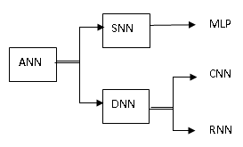

```{r setup, include=FALSE}
knitr::opts_chunk$set(echo = FALSE)
```

## 1. Artificial neural networks

### 1.1 Brief overview of networks

Artificial neural networks (ANNs) refer to a collection of computing algorithms inspired by the structure of biological neural networks. ANNs consist of layers of interconnected nodes. They include Shallow neural network (SNN), such as multi-layer perception (MLP), and Deep neural networks (DNN). MLPs consis of a set of fully connected layers, and use forward propagation for inputs and backpropagation for updating the weights. 

DNNs can be divided into Convolutional Neural Network (CNN), which is designed for processing grid-like data such as images, and Recurrent Neural Network (RNN), which is designed for sequential data like time series or sentences. CNNs consist of the input layer, convolution layer, pooling layer, fully connected layer, and output layer.

<cengter>
{width=60%}
</center>
<br>

### 1.2 R packages for networks

There are some [packages](https://subscription.packtpub.com/book/big-data-and-business-intelligence/9781788992893/1/ch01lvl1sec06/setting-up-your-r-environment) that can fit basic neural networks. For example, the **nnet** package can fit feed-forward neural networks with one hidden layer. The **neuralnet** package fits neural networks with multiple hidden layers using back-propagation. The **RSNNS** package makes many model components for training a wide variety of models. The **deepnet** package provides a number of tools for deep learning, as well as allows for different activation functions and the use of dropout for regularization.

For example, here is the code for iris classification using the neuralnet package. For detials, see [the website](https://www.datacamp.com/tutorial/neural-network-models-r).

```{r}
# library(tidyverse)
# library(neuralnet)
# iris <- iris %>% mutate_if(is.character, as.factor)
# summary(iris)
# set.seed(245)
# data_rows <- floor(0.80 * nrow(iris)) # similar to ceiling()
# train_indices <- sample(c(1:nrow(iris)), data_rows)
# train_data <- iris[train_indices,]
# test_data <- iris[-train_indices,]
# model = neuralnet(
#     Species~Sepal.Length+Sepal.Width+Petal.Length+Petal.Width,
# data=train_data,
# hidden=c(4,2), # two hidden layers, first 4 and second 2 neurons
# linear.output = FALSE)
# plot(model,rep = "best")
# pred <- predict(model, test_data)
# labels <- c("setosa", "versicolor", "virginca")
# prediction_label <- data.frame(max.col(pred)) %>%     
# mutate(pred=labels[max.col.pred.]) %>%
# select(2) %>%
# unlist()
# table(test_data$Species, prediction_label)
# check = as.numeric(test_data$Species) == max.col(pred)
# accuracy = (sum(check)/nrow(test_data))*100
# print(accuracy)
```

### 1.3 Setting R env for running keras

**h2o** (https://www.h2o.ai/) is a general machine learning framework written in Java, and has an API that allows to use it from R. However, most deep learning practitioners prefer other deep learning libraries, such as **TensorFlow**, **CNTK**, and **MXNet**. **Keras** is actually a frontend abstraction for other deep learning libraries, and can use TensorFlow in the background. 

**Keras** is a high-level deep learning framework that emphasizes iterative and fast development. **Keras** models can be deployed on any environment, such as a web server, iOS, Android, a browser, or the Raspberry Pi. Now using Tensorflow’s Keras is recommended over the standalone keras package.

To learn more about Keras in R, go to https://keras.rstudio.com; this link will also has more examples of R and Keras, as well as a handy Keras cheat sheet that gives a thorough reference to all of the functionality of the Keras package.


For running keras in Rstudio, we should make sure which python that we use, and create a virtual environment. Here is the code for creating a virtual python env., which is named "r-reticulate".

```{r echo=TRUE}
# library(reticulate)
# py_config() # for environment information
# install_python # for linux OS 
# install_miniconda() # for win OS
```

Then we install the python packages, such as tensorflow and keras using py_install() from reticulate or use pip at the terminal in Rstudion to istall them. After that, we install the R packages of keras and tensorflow. 

```{r}
# reticulate::py_install(c('tensorflow-gpu==2.2','tensorflow-addons'), pip = TRUE)
# devtools::install_github("rstudio/keras")
# library(keras)
```

## 2. Basic conception of DL models

### 2.1 Neutral network architechture

ANN is a forward propagation network that is consists of artificial neurons together and grouped in different levels known as layers. These are the 3 layers applied in structured artificial neural networks: Input Layer, Hidden Layer and Output Layer. This network is like this:

{width=40% heigh=20% .external}

The architecture of ANN is different from that of RNN, which is used in natural language and speech recognition by processing sequential data. RNN can process different types of data at various moments in time. Its Architecture is like this.

{width=40% heigh=20% .external}

### 2.2 Building neutral networks

A Keras model is the Sequential or functional class. Here we focus on the sequential model. For more details, see [the site](https://www.kaggle.com/code/ryanholbrook/a-single-neuron)

Neural networks are composed of neurons, each of which individually performs only a simple computation (see the box1). 

<div class="warning" style='padding:0.1em; background-color:#E9D8FD; color:#69337A'>
<span>
<p style='margin-top:1em; text-align:center'>
<b>Box 1: Basic knowledge of neural networks</b></p>
<p style='margin-left:1em;'>

**Single Input**

A larger network starts with a single neuron model as a baseline. Single neuron models are linear models. For example, training a model with 'sugars' as input and 'calories' as output in the dataset of [cereals](https://www.kaggle.com/datasets/crawford/80-cereals) like this.

<br>
<center>
{width="30%"}
</center></br>

The formula for this neuron would be $y=wx+b$

**Multiple Inputs**

If we wanted to expand our model to include things like fiber or protein content, we can just add more input connections to the neuron, and multiply each input to its connection weight and then add them all together.

<br>
<center>
{width=30%}
</center></br>

The formula for this neuron would be  $y=w_{0}x_{0}+w_{1}x_{1}+w_{2}x_{2}+b$.
<br>
</p>
<p style='margin-bottom:1em; margin-right:1em; text-align:right; font-family:Georgia'> 
</p></span>
</div>
<br>

We can define the sequential model for allowing a neural network to "learns" by modifying the weight of each feature.

```{r echo=TRUE}
# Create a network with one linear unit
#model = keras.Sequential([
#    layers.Dense(units=1, input_shape=[3])
#])
```

The first argument, units, defining how many outputs we want. In the case just predicting 'calories', so units=1. The second argument, input_shape, tell Keras the dimensions of the inputs. Setting input_shape=[3] ensures the model to accept three features as input ('sugars', 'fiber', and 'protein'). This model is now ready to be fit to training data!

We can combine and modify the single units to model complex relationships that DL work for. Let's see the box2 to understand how we stack layers to get complex data transformations. We have some nonlinearity with activation functions (see the box2).

<div class="warning" style='padding:0.1em; background-color:#E9D8FD; color:#69337A'>
<span>
<p style='margin-top:1em; text-align:center'>
<b>Box 2: Constructing neural networks</b></p>
<p style='margin-left:1em;'>

**Layers**

We collect together linear units, and then get a dense layer through a common set of inputs. 

<br><center>
{width=30%}
</center></br>

Each layer in a neural network performs relatively simple transformation. Through a deep stack of layers, a neural network can transform its inputs in more and more complex ways.

**Activation Function**

We stack layers inside a Sequential model, and add an activation function to each hidden layer, then a network has an ability to learn more complex (non-linear) relationships in data. Without activation functions, neural networks only learn linear relationships (lines and planes). For details on how to choose an activation function of a hidden Layer, see [the website](https://machinelearningmastery.com/choose-an-activation-function-for-deep-learning/).

The common activation function is the rectifier function max(0,x).

<br>
<center>
{width=40%}
</center>
</br>

When we attach the rectifier to a linear unit, we get a rectified linear unit or ReLU. Applying a ReLU activation to a linear unit means the output becomes $max(0, w * x + b)$. For the following network, its hidden layers' activation function is ReLU.

<br><center>
{width=50%}
</center></br>

For an output layer, if it is a linear unit with no activation function, that makes this network appropriate to a regression task, where we can predict some arbitrary numeric value. Other tasks (like classification) might require an activation function, such as softmax, on the output.

</p>
<p style='margin-bottom:1em; margin-right:1em; text-align:right; font-family:Georgia'> 
</p></span>
</div>
<br>

The Sequential model we've been using will connect together a list of layers in order from first layer (input) to last layer (output). This creates a model in the above figure.

```{r echo=TRUE}
#model = keras.Sequential([
    # the first hidden layer
    #   layers.Dense(units=4, activation='relu', input_shape=[2]),

    # the second hidden layer
    #   layers.Dense(units=3, activation='relu'),

    # the linear output layer
    #   layers.Dense(units=1),
##])
```

As for the dataset of [cereals](https://www.kaggle.com/datasets/crawford/80-cereals), we choose a three-layer network with over 1500 neurons. It can be capable of learning fairly complex relationships in the data.

```{r echo=TRUE}
#model = keras.Sequential([
#    layers.Dense(512, activation='relu', input_shape=[11]),
#    layers.Dense(512, activation='relu'),
#    layers.Dense(512, activation='relu'),
#    layers.Dense(1),
#])
```

### 2.3 Compiling neutral networks

Training a ANN model is to adjust its weights so that it can transform the features (inputs) into the target (output). If successfully train a network, its weights must represent some relationships between those features and that target (see the box3).


<div class="warning" style='padding:0.1em; background-color:#E9D8FD; color:#69337A'>
<span>
<p style='margin-top:1em; text-align:center'>
<b>Box 3: Compiling neural networks</b></p>
<p style='margin-left:1em;'>

**The Loss Function**

The loss function measures the disparity between the target's true value and the predicted value by models. A common loss function for regression is the mean absolute error (MAE), i.e., abs(y_true - y_pred). Other loss functions for regression problems are the mean-squared error (MSE) or the Huber loss (available in Keras). For classification, the common function is to measure the accuracy.

**Optimizer, minibatch and epoch**

All of the optimization algorithms used in DL belong to a family called stochastic gradient descent (SGD). They are iterative algorithms that train a network in steps like this:

- Sample training data and run it to pass a network to make predictions.
- Measure the loss between the predicted and true values.
- Finally, adjust the weights in a direction that makes the loss smaller.

Adam is an SGD algorithm that has an adaptive learning rate that makes it suitable for most problems without any parameter tuning. Adam is a great general-purpose optimizer. RMSpro is a good one for regression problems.

Each iteration sample of training data is called minibatch or batch, while a complete round of the training data is called an epoch. The number of epochs you train is how many times the network will see each training example.

**Learning Rate and Batch Size**

The learning rate and the size of the minibatches are the two parameters that have the largest effect on how the SGD training proceeds.  

</p>
<p style='margin-bottom:1em; margin-right:1em; text-align:right; font-family:Georgia'> 
</p></span>
</div>
<br>

After understanding these, now we can compile the squential model with the optimizer and loss function.


```{r echo=TRUE}
# for regression
# model.compile(
#    optimizer='adam',
#    loss='mae')
```

Now we're ready to start training! We tell Keras to feed the optimizer 256 rows of the training data at a time (the batch_size) and to do that 10 times all the way through the dataset (the epochs).

```{r echo=TRUE}
#history = model.fit(
#    X_train, y_train,
#    validation_data=(X_valid, y_valid),
#    batch_size=256,
#    epochs=10)
```

### 2.4 Improving network models

**Capacity**: A model capacity (the size and complexity of the patterns it is able to learn) is determined by its architecture, in which how many neurons it has and how the neurons are connected together. If the network is underfitting data, we should try increasing its capacity.

We can increase the capacity of a network either by making it wider (more units to layers) or by making it deeper (more layers). The wider networks have an easier time learning more linear relationships, while the deeper networks prefer more nonlinear ones. Which is better just depends on the dataset.


```{r echo=TRUE}
#model = keras.Sequential([
#    layers.Dense(16, activation='relu'),
#    layers.Dense(1)])

#wider = keras.Sequential([
#    layers.Dense(32, activation='relu'),
#    layers.Dense(1)])

#deeper = keras.Sequential([
#    layers.Dense(16, activation='relu'),
#    layers.Dense(16, activation='relu'),
#    layers.Dense(1)])
```


**Early Stopping**: Keras keeps a history of the training and validation loss over the epochs. We'll examine the learning curves for evidence of underfitting and overfitting for correcting it (see the box4).

<div class="warning" style='padding:0.1em; background-color:#E9D8FD; color:#69337A'>
<span>
<p style='margin-top:1em; text-align:center'>
<b>Box 4: Improving neural networks</b></p>
<p style='margin-left:1em;'>

**Learning Curves**

When we train a model we've been plotting the loss on the training set epoch by epoch. To this we'll add a plot the validation data too. These plots we call the learning curves.

<center>
{width=40%}
</center>

When a model learns signal both curves go down, but when it learns noise a gap is created in the curves. You should create models that minimize the size of the gap.

**Early Stopping**

When a model is too eagerly learning noise, the validation loss may start to increase during training. To prevent this, we can simply stop the training whenever it seems the validation loss isn't decreasing anymore. Interrupting the training this way is called early stopping.

<center>
{width=40%}
</center>

Once we detect that the validation loss is starting to rise again, we can reset the weights back to where the minimum occured. This ensures that the model won't continue to learn noise and overfit the data.

</p>
<p style='margin-bottom:1em; margin-right:1em; text-align:right; font-family:Georgia'> 
</p></span>
</div>
<br>

In Keras, we include early stopping in our training through a callback. A callback is just a function you want run every so often while the network trains. The early stopping callback will run after every epoch.

```{r echo=TRUE}
#early_stopping = callbacks.EarlyStopping(
#    min_delta=0.001, # minimium amount of change to count as an improvement
#    patience=20, # how many epochs to wait before stopping
#    restore_best_weights=True,
#)
```

**Special layers**: There are some special layers that do not contain any neurons, but that they are added prevent overfitting and stabilize training. See the box5

<div class="warning" style='padding:0.1em; background-color:#E9D8FD; color:#69337A'>
<span>
<p style='margin-top:1em; text-align:center'>
<b>Box 5: Adding special layers</b></p>
<p style='margin-left:1em;'>

**Dropout**

We randomly drop out some fraction of a layer's input units every step of training, making it much harder for the network to learn those spurious patterns in the training data. Instead, it has to search for broad, general patterns, whose weight patterns tend to be more robust. If you're familiar with random forests as an ensemble of decision trees, it's the same idea.

<center>
{width=40%}
</center>

**Batch Normalization**

It's generally a good idea to put all of data on a common scale. A good practise for normalizing inside the network! This special kind of layer can do this. A batch normalization layer looks at each batch as it comes in, first normalizing the batch with its own mean and standard deviation, and then putting the data on a new scale with two trainable rescaling parameters. A batch normalization can correct training that is slow or unstable. 

</p>
<p style='margin-bottom:1em; margin-right:1em; text-align:right; font-family:Georgia'> </p></span>
</div>
<br>

In Keras, the dropout rate argument rate defines what percentage of the input units to shut off. Put the Dropout layer just before the layer you want the dropout applied to.

```{r echo=TRUE}
#keras.Sequential([
#    # ...
#    layers.Dropout(rate=0.3), # apply 30% dropout to the next layer
#    layers.Dense(16),
#    # ...
#])
```

As for batch normalization layers, you can put it after a layer...

```{r echo=TRUE}
#layers.Dense(16, activation='relu'),
#layers.BatchNormalization(),
```

... or between a layer and its activation function:

```{r echo=TRUE}
#layers.Dense(16),
#layers.BatchNormalization(),
#layers.Activation('relu'),
```

And if you add it as the first layer of your network it can act as a kind of adaptive preprocessor, standing in for something like Sci-Kit Learn's StandardScaler.

<!-- ### 2.5 Examples of ANN  -->

<!-- You are suggested to visit [the site](https://rpubs.com/Nilafhiosagam/541333) or [another site](https://www.kaggle.com/code/yashgyy/deep-learning-with-r-keras-iris-dataset) -->

<!-- Generally, the Keras script for ANN probably looked like this. -->

<!-- ```{r} -->
<!-- # # Load entire dataset -->
<!-- # # Design model -->
<!-- # model = Sequential() -->
<!-- # [...] # Your architecture -->
<!-- # model.compile() -->
<!-- # # Train model on your dataset -->
<!-- # model.fit(x=X, y=y) -->
<!-- ``` -->

<!-- **Step 1: Checking and setting environment** -->

<!-- Please checking your Rstudio whether it runs in a virtural environment by opening the terminal in Rstudio. If not, doing the following things step-by-step and then examining it again. -->

<!-- ```{r echo=TRUE} -->
<!-- # rm(list = ls()) -->
<!-- # install.packages("reticulate") -->
<!-- # reticulate::py_config() -->
<!-- # reticulate::py_install(c('tensorflow-gpu==2.2','tensorflow-addons'), pip = TRUE) -->
<!-- # library(keras) -->
<!-- ``` -->
<!-- Then loading the data and doing some pre-process them. -->

<!-- **Sept 2: Load iris data and pre-process them** -->

<!-- ```{r echo=TRUE} -->
<!-- # library(tidyverse) -->
<!-- # library(datasets) -->
<!-- # data(iris) -->
<!-- ``` -->
<!-- keras working with a matrix, which elements are the same type, while the targets are factors, the rest is numeric. Use as.numeric() to convert the data to numbers -->

<!-- ```{r echo=TRUE} -->
<!-- # iris[,5] <- as.numeric(iris[,5]) -1 # Transfer the target into numbers, and all -1 for 0, 1, and 2 -->
<!-- # iris <- as.matrix(iris) # Turn `iris` into a matrix -->
<!-- # dimnames(iris) <- NULL # Set iris `dimnames` to `NULL`, that is, just a matrix -->
<!-- ``` -->

<!-- The data are then split into training and test sets by running the following code -->

<!-- ```{r echo=TRUE} -->
<!-- set.seed(1234) -->
<!-- ind <- sample(2, nrow(iris), replace=TRUE, prob=c(0.7, 0.3)) # Sample size "2" means two sets of 1 and 2, sample with replacement -->

<!-- xtrain <- iris[ind==1, 1:4] # Split the features -->
<!-- xtest <- iris[ind==2, 1:4] -->
<!-- ytrain <- iris[ind==1, 5] # Split the targets -->
<!-- ytest <- iris[ind==2, 5] -->
<!-- ``` -->

<!-- For multi-class classification with neural networks, transforming the targets from vector value (0,1,2) to matrix with a boolean for each class -->

<!-- ```{r echo=TRUE} -->
<!-- # trainLabels <- to_categorical(ytrain) # One hot encode training target values -->
<!-- # testLabels <- to_categorical(ytest) # One hot encode test target values -->
<!-- # print(testLabels) # Print out the iris.testLabels to double check the result -->
<!-- ``` -->

<!-- **Step 3: Constructing model and training the model** -->

<!-- Initializing a sequential model that is fully connected, with an activation functions -->

<!-- ```{r echo=TRUE} -->
<!-- # model <- keras_model_sequential() # Initialize a sequential model -->
<!-- # model %>% # Add layers to the model: 4 columns -->
<!-- #   layer_dense(units = 8, activation = 'relu', input_shape = c(4)) %>%  -->
<!-- #   layer_dense(units = 3, activation = 'softmax') -->
<!-- # summary(model) # Print a summary of a model -->
<!-- ``` -->

<!-- With two arguments of optimizer and loss, compiling and fitting the model to training data -->

<!-- ```{r echo=TRUE} -->
<!-- # model %>% compile( # Compile the model -->
<!-- #   loss = 'categorical_crossentropy', # binary classes use binary_crossentropy -->
<!-- #   optimizer = 'adam', # can use Stochastic Gradient Descent (SGD) and RMSprop -->
<!-- #   metrics = 'accuracy' #  for a regression use MSE. -->
<!-- # ) -->
<!-- ``` -->

<!-- After that, training the model. -->

<!-- ```{r echo=TRUE} -->
<!-- # history <- model %>% fit( # Store the fitting history in `history`  -->
<!-- #   xtrain,  -->
<!-- #   trainLabels,  -->
<!-- #   epochs = 200, -->
<!-- #   batch_size = 5,  -->
<!-- #   validation_split = 0.2 -->
<!-- # ) -->
<!-- #  -->
<!-- # plot(history) # Plot the history -->
<!-- ``` -->

<!-- **Step 4: Evaluating the model** -->
<!-- Visualizing the training history to make two separate, one for the model loss and another for its model accuracy -->

<!-- ```{r echo=TRUE} -->
<!-- # plot(history$metrics$loss, main="Model Loss", xlab = "epoch",  -->
<!-- #      ylab="loss", col="blue", type="l") # Plot the model loss of the training data -->
<!-- # lines(history$metrics$val_loss, col="green") # Plot the model loss of the validation data -->
<!-- # legend("topright", c("train","test"), col=c("blue", "green"), lty=c(1,1)) # Add legend -->
<!-- #  -->
<!-- # plot(history$metrics$acc, main="Model Accuracy", xlab = "epoch", ylab="accuracy", col="blue", type="l") # Plot the accuracy of the training data  -->
<!-- # lines(history$metrics$val_acc, col="green") # Plot the accuracy of the validation data -->
<!-- # legend("bottomright", c("train","test"), col=c("blue", "green"), lty=c(1,1)) # Add Legend -->
<!-- ``` -->

<!-- **Step 5: prediction with test data** -->
<!-- Using the model to predict the labels for the test set. As for the multi-class classification with softmax, model %>% predict(x) %>% k_argmax(). As for binary classification with sigmoid, model %>% predict(x) %>% >(0.5) %>% k_cast("int32") -->

<!-- ```{r echo=TRUE} -->
<!-- # classes <- model %>%  -->
<!-- #   predict(xtest, batch_size = 28) %>%  -->
<!-- #   k_argmax() # get the max possibility of a specific class -->
<!-- # table(ytest, as.vector(classes)) # Confusion matrix -->
<!-- # score <- model %>% evaluate(xtest, testLabels, batch_size = 128) # Evaluate on test data and labels -->
<!-- # print(score) # Print the score -->
<!-- ``` -->

<!-- **Step 6: Fine-tuning model** -->

<!-- Adjusting the number of layers and hidden units as well as the number of epochs or the batch size to improve the model. -->

<!-- ```{r echo=TRUE} -->
<!-- # model2 <- keras_model_sequential() # Initialize the sequential model -->
<!-- # model2 %>% # Adding layers to model -->
<!-- #   layer_dense(units = 8, activation = 'relu', input_shape = c(4)) %>%  -->
<!-- #   layer_dense(units = 5, activation = 'relu') %>%  -->
<!-- #   layer_dense(units = 3, activation = 'softmax') -->
<!-- #  -->
<!-- # model2 %>% compile(# Compile the model -->
<!-- #   loss = 'categorical_crossentropy', -->
<!-- #   optimizer = 'adam', -->
<!-- #   metrics = 'accuracy' -->
<!-- # ) -->
<!-- #  -->
<!-- # model2 %>% fit(# Fit the model to the data -->
<!-- #   xtrain, trainLabels,  -->
<!-- #   epochs = 200, batch_size = 5,  -->
<!-- #   validation_split = 0.2 -->
<!-- # ) -->
<!-- #  -->
<!-- # score2 <- model2 %>%  -->
<!-- #   evaluate(xtest, testLabels, batch_size = 128)# Evaluate the model -->
<!-- # print(score2) # Print the score -->
<!-- ``` -->

<!-- By reducing or adding hidden units to model for improving the model, like this. -->

<!-- ```{r echo=TRUE} -->
<!-- # model3 <- keras_model_sequential() # Initialize a sequential model -->
<!-- # model3 %>% # Add layers to model -->
<!-- #   layer_dense(units = 28, activation = 'relu', input_shape = c(4)) %>%  -->
<!-- #   layer_dense(units = 3, activation = 'softmax') -->
<!-- #  -->
<!-- # model3 %>% compile(# Compile the model -->
<!-- #   loss = 'categorical_crossentropy', -->
<!-- #   optimizer = 'adam', -->
<!-- #   metrics = 'accuracy' -->
<!-- # ) -->
<!-- #  -->
<!-- # model3 %>% fit(# Fit the model to the data -->
<!-- #   xtrain, trainLabels,  -->
<!-- #   epochs = 200, batch_size = 5,  -->
<!-- #   validation_split = 0.2 -->
<!-- # ) -->
<!-- #  -->
<!-- # score3 <- model3 %>%  -->
<!-- #   evaluate(xtest, testLabels, batch_size = 128) # Evaluate the model -->
<!-- #  -->
<!-- # print(score3) # Print the score -->
<!-- ``` -->

<!-- **Step 7: Saving and Loading the best Model** -->

<!-- You can save and reload the model, and even deploy them on other platforms  -->

<!-- ```{r echo=TRUE} -->
<!-- # save_model_hdf5(model, "results/my_model.h5") -->
<!-- # model <- load_model_hdf5("results/my_model.h5") -->
<!-- ``` -->

<!-- #### 2.5.2 Runing DL for regression -->

<!-- Building a regression model using deep learning algorithm, please refer to [the site](https://tensorflow.rstudio.com/tutorials/keras/regression). It also follows these steps. -->

<!-- **Step 1: Checking the environment and loading packages** -->

<!-- ```{r echo=TRUE} -->
<!-- # rm(list = ls()) -->
<!-- # library(tensorflow) # loading the the four packages -->
<!-- # library(keras) -->
<!-- # library(tidyverse) -->
<!-- # library(tidymodels) -->
<!-- ``` -->

<!-- **Step 2: Loading data and pre-process** -->

<!-- Loading the data from a website and then clearning them for further analysis. -->

<!-- ```{r echo=TRUE} -->
<!-- # url <- "http://archive.ics.uci.edu/ml/machine-learning-databases/auto-mpg/auto-mpg.data" # loading the data from a URL -->
<!-- # col_names <- c("mpg","cylinders","displacement","horsepower","weight", -->
<!-- #                "acceleration","model_year", "origin","car_name") -->
<!-- # raw_dataset <- read.table( -->
<!-- #   url, -->
<!-- #   header = T, -->
<!-- #   col.names = col_names, -->
<!-- #   na.strings = "?" -->
<!-- # ) -->
<!-- #  -->
<!-- # dataset <- raw_dataset %>% select(-car_name) -->
<!-- #  -->
<!-- # # cleaning the data -->
<!-- # lapply(dataset, function(x) sum(is.na(x))) %>% str() # Drop those rows with NA -->
<!-- # dataset <- na.omit(dataset) -->
<!-- #  -->
<!-- # dataset <- recipe(mpg ~ ., dataset) %>%  # one-hot encode for the original column  -->
<!-- #   step_num2factor(origin, levels = c("USA", "Europe", "Japan")) %>% -->
<!-- #   step_dummy(origin, one_hot = TRUE) %>% # using step_dummy(one_hot = FALSE) for binary -->
<!-- #   prep() %>% # update the recipe -->
<!-- #   bake(new_data = NULL) # view preProcessing data  -->
<!-- #  -->
<!-- # glimpse(dataset) -->
<!-- ``` -->

<!-- Splitting the data into training and test sets, and separating features from labels. Using train set for building model and test set for evaluation of model. -->

<!-- ```{r echo=TRUE} -->
<!-- # split <- initial_split(dataset, 0.8) -->
<!-- # train_dataset <- training(split) -->
<!-- # test_dataset <- testing(split)  -->
<!-- ``` -->

<!-- Reviewing the distribution of a few pairs of columns from the training set, then you may normalize the features and do some conversion of targets. There are lots of things that should be considered. -->

<!-- ```{r echo=TRUE} -->
<!-- # train_dataset %>% -->
<!-- #   select(mpg, cylinders, displacement, weight) %>% -->
<!-- #   GGally::ggpairs() # help identifying the correlations among variables -->
<!-- #  -->
<!-- # skimr::skim(train_dataset) # an alternative to summary() # Note each feature covers a very different range -->
<!-- #  -->
<!-- # # Split features from labels and normalizing feature values of train set -->
<!-- # train_features <- train_dataset %>% select(-mpg) -->
<!-- # test_features <- test_dataset %>% select(-mpg) -->
<!-- #  -->
<!-- # train_labels <- train_dataset %>% select(mpg) -->
<!-- # test_labels <- test_dataset %>% select(mpg) -->
<!-- #  -->
<!-- # # see the different of each feature range and possibly skipping the step -->
<!-- # # my_skim <- skimr::skim_with(numeric = skimr::sfl(mean, sd)) # self-defining summary -->
<!-- # # train_dataset %>% -->
<!-- # #   select(where(~is.numeric(.x))) %>% -->
<!-- # #   pivot_longer( -->
<!-- # #     cols = everything(), names_to = "variable", values_to = "values") %>% -->
<!-- # #   group_by(variable) %>% -->
<!-- # #   summarise(mean = mean(values), sd = sd(values)) -->
<!-- #  -->
<!-- # normalizer <- layer_normalization(axis = -1L) # feature values transferred to the range [0,1] -->
<!-- # normalizer %>% adapt(as.matrix(train_features)) -->
<!-- # print(normalizer$mean) -->
<!-- #  -->
<!-- # # first <- as.matrix(train_features[1,]) -->
<!-- # # cat('First example:', first) -->
<!-- # # cat('Normalized:', as.matrix(normalizer(first))) -->

<!-- # # Normalizing the 'horsepower' input feature  -->
<!-- # horsepower <- matrix(train_features$horsepower) # creating a matrix of the feature -->
<!-- # horsepower_normalizer <- layer_normalization(input_shape = shape(1), axis = NULL) -->
<!-- # horsepower_normalizer %>% adapt(horsepower) -->
<!-- ``` -->

<!-- **Step 3: Building and evaluating linear Model ** -->

<!-- First, building a linear regression with different conditions. First, building a linear regression between 'mpg' and 'horsepower', i.e., for 1 output. -->

<!-- ```{r echo=TRUE} -->
<!-- # horsepower_model <- keras_model_sequential() %>% -->
<!-- #   horsepower_normalizer() %>% -->
<!-- #   layer_dense(units = 1) -->
<!-- # # summary(horsepower_model) -->
<!-- # # Using the untrained model on the first 10 ‘horsepower’ values -->
<!-- # # predict(horsepower_model, horsepower[1:10,]) -->

<!-- # Configuring the training procedure with keras's compile(). -->
<!-- # horsepower_model %>% compile( -->
<!-- #   optimizer = optimizer_adam(learning_rate = 0.1), -->
<!-- #   loss = 'mean_absolute_error' # to be optimized -->
<!-- # ) -->

<!-- # Executing to train a model for 100 epochs -->
<!-- # history <- horsepower_model %>% fit( -->
<!-- #   as.matrix(train_features$horsepower), -->
<!-- #   as.matrix(train_labels), -->
<!-- #   epochs = 100, -->
<!-- #   verbose = 0, # Suppress logging -->
<!-- #   validation_split = 0.2 # validation on 20% of the training data -->
<!-- # ) -->
<!-- # plot(history) # Visualizing the model’s training progress  -->

<!-- # Collecting the results on the test set -->
<!-- # test_results <- list() -->
<!-- # test_results[["horsepower_model"]] <- horsepower_model %>% evaluate( -->
<!-- #   as.matrix(test_features$horsepower), -->
<!-- #   as.matrix(test_labels), -->
<!-- #   verbose = 0 -->
<!-- # ) -->
<!-- # test_results -->
<!-- ``` -->

<!-- Second, building a linear regression with multiple inputs -->

<!-- ```{r echo=TRUE} -->
<!-- # # Constructing a linear regression Model -->
<!-- # linear_model <- keras_model_sequential() %>% -->
<!-- #   normalizer() %>% -->
<!-- #   layer_dense(units = 1) -->

<!-- # summary(horsepower_model) -->
<!-- # Using the untrained model on the first 10 ‘horsepower’ values               -->
<!-- # predict(linear_model, as.matrix(train_features[1:10, ])) -->
<!-- # linear_model$layers[[2]]$kernel -->

<!-- # # configuring the training procedure -->
<!-- # linear_model %>% compile( -->
<!-- #   optimizer = optimizer_adam(learning_rate = 0.1), -->
<!-- #   loss = 'mean_absolute_error' -->
<!-- # ) -->

<!-- # # executing to train a model for 100 epochs -->
<!-- # history <- linear_model %>% fit( -->
<!-- #   as.matrix(train_features), -->
<!-- #   as.matrix(train_labels), -->
<!-- #   epochs = 100, -->
<!-- #   verbose = 0, -->
<!-- #   validation_split = 0.2 -->
<!-- # ) -->

<!-- # # Visualizing the model’s training progress  -->
<!-- # plot(history)  -->
<!-- #  -->
<!-- # # Collecting the results on the test set -->
<!-- # test_results[['linear_model']] <- linear_model %>% -->
<!-- #   evaluate( -->
<!-- #     as.matrix(test_features), -->
<!-- #     as.matrix(test_labels), -->
<!-- #     verbose = 0 -->
<!-- #   ) -->
<!-- ``` -->

<!-- Third, building a deep neural network (DNN) regression with a single input -->

<!-- ```{r echo=TRUE} -->
<!-- # # Normalizing the 'horsepower' input feature  -->
<!-- # horsepower <- matrix(train_features$horsepower) # creating a matrix of the feature -->
<!-- # horsepower_normalizer <- layer_normalization(input_shape = shape(1), axis = NULL) -->
<!-- # horsepower_normalizer %>% adapt(horsepower) -->
<!-- #  -->
<!-- # # Constructing a linear regression Model for 1 output -->
<!-- # dnn_horsepower_model <- keras_model_sequential() %>% -->
<!-- #   horsepower_normalizer() %>% -->
<!-- #   layer_dense(64, activation = 'relu') %>% -->
<!-- #   layer_dense(64, activation = 'relu') %>% -->
<!-- #   layer_dense(1) -->
<!-- #  -->
<!-- # # configuring the training procedure with keras's compile() -->
<!-- # dnn_horsepower_model %>% compile( -->
<!-- #   optimizer = optimizer_adam(learning_rate = 0.1), -->
<!-- #   loss = 'mean_absolute_error' # to be optimized -->
<!-- # ) -->
<!-- #  -->
<!-- # # executing to train a model for 100 epochs -->
<!-- # history <- dnn_horsepower_model %>% fit( -->
<!-- #   as.matrix(train_features$horsepower), -->
<!-- #   as.matrix(train_labels), -->
<!-- #   epochs = 100, -->
<!-- #   verbose = 0,  -->
<!-- #   validation_split = 0.2  -->
<!-- # ) -->
<!-- #  -->
<!-- # # Visualizing the model’s training progress  -->
<!-- # plot(history)  -->
<!-- #  -->
<!-- # # Collecting the results on the test set -->
<!-- # test_results[["dnn_horsepower_model"]] <- dnn_horsepower_model %>% evaluate( -->
<!-- #   as.matrix(test_features$horsepower), -->
<!-- #   as.matrix(test_labels), -->
<!-- #   verbose = 0 -->
<!-- # ) -->

<!-- ``` -->

<!-- Forth, building a deep neural network (DNN) regression with multiple inputs -->

<!-- ```{r echo=TRUE} -->
<!-- # # Normalizing the input features  -->
<!-- # # normalizer <- layer_normalization(axis = -1L) # feature values transferred to the range [0,1] -->
<!-- # # normalizer %>% adapt(as.matrix(train_features)) -->
<!-- #  -->
<!-- # # Constructing a linear regression Model -->
<!-- # dnn_model <- keras_model_sequential() %>% -->
<!-- #   normalizer() %>% -->
<!-- #   layer_dense(64, activation = 'relu') %>% -->
<!-- #   layer_dense(64, activation = 'relu') %>% -->
<!-- #   layer_dense(1) -->
<!-- #  -->
<!-- # # configuring the training procedure -->
<!-- # dnn_model %>% compile( -->
<!-- #   optimizer = optimizer_adam(learning_rate = 0.1), -->
<!-- #   loss = 'mean_absolute_error' -->
<!-- # ) -->
<!-- #  -->
<!-- # # executing to train a model for 100 epochs -->
<!-- # history <- dnn_model %>% fit( -->
<!-- #   as.matrix(train_features), -->
<!-- #   as.matrix(train_labels), -->
<!-- #   epochs = 100, -->
<!-- #   verbose = 0, -->
<!-- #   validation_split = 0.2 -->
<!-- # ) -->
<!-- # # Visualizing the model’s training progress  -->
<!-- # plot(history)  -->
<!-- #  -->
<!-- # # Collecting the results on the test set -->
<!-- # test_results[['dnn_model']] <- dnn_model %>% -->
<!-- #   evaluate( -->
<!-- #     as.matrix(test_features), -->
<!-- #     as.matrix(test_labels), -->
<!-- #     verbose = 0 -->
<!-- #   ) -->
<!-- #  -->
<!-- # sapply(test_results, function(x) x) -->
<!-- ``` -->

<!-- **Step 4: Make predictions**  -->

<!-- ```{r echo=TRUE} -->
<!-- # # make prediction on the test set -->
<!-- # test_predictions <- predict(dnn_model, as.matrix(test_features)) -->
<!-- # ggplot(data.frame(pred = as.numeric(test_predictions), mpg = test_labels$mpg)) + -->
<!-- #   geom_point(aes(x = pred, y = mpg)) + -->
<!-- #   geom_abline(intercept = 0, slope = 1, color = "blue") -->
<!-- #  -->
<!-- # # check the error distribution -->
<!-- # qplot(test_predictions - test_labels$mpg, geom = "density") -->
<!-- # error <- test_predictions - test_labels -->
<!-- ``` -->

<!-- **Step 5: saving the model and reloading it** -->

<!-- ```{r echo=TRUE} -->
<!-- # save_model_tf(dnn_model, 'results/dnn_model1.h5') -->
<!-- # reloaded <- load_model_tf('results/dnn_model1') -->
<!-- #  -->
<!-- # test_results[['reloaded']] <- reloaded %>% evaluate( -->
<!-- #   as.matrix(test_features), -->
<!-- #   as.matrix(test_labels), -->
<!-- #   verbose = 0 -->
<!-- # ) -->
<!-- ``` -->

## 4. The application of DL to ecology

- **Prediction of farmland fertility**: The networks receive images from satellites like LSAT and can use this information to classify lands based on their level of cultivation. Consequently, this data can be used for making predictions about the fertility level of the grounds or developing a strategy for the optimal use of farmland.

- **Topological analysis**: A key aim of ecosystem analysis is to determine how stable an ecosystem is, and how it might react to environmental change. Therefore, a large amount of research has been concerned with determining the stability of ecosystems using theoretical techniques. These ideas were introduced by Elton, who described a community matrix M of size n × n for which the (i, j)-th entry represents the impact that a species h has on another species j around an equilibrium point of some unobserved dynamical system. This allowed stability analysis techniques from dynamical systems literature to be used, where a system is considered stable to small perturbations if the eigenvalues λ of M all have negative real parts. The original study was concerned with random community matrices, but the same ideas have since been refined and applied to realistic community matrices. This area of research has been used to contribute to the ongoing debate about the relationship between biodiversity and ecosystem stability.

- **Species importance metrics**: It is often of interest to ecologists which species are the most influential within their ecosystem. These species are known as keystone species. This has consequences in conservation, since the loss of a keystone species could lead to the collapse of an entire ecosystem. Traditionally, keystone species were identified from their natural history, but it is often difficult to experimentally verify this. This has led to the introduction of graph-theoretic species importance metrics which aim to discover keystone species by considering the topology of the network.

- **Network structure prediction**: Machine learning algorithms are able to discover patterns in data, and use those patterns to make predictions about previously unseen data samples. This had led to widespread use of ML in many different domains to automate laborious tasks which are expensive in terms of both time and money. Ecological networks are generally constructed in such ways, and therefore it is highly desirable to develop machine learning algorithms which automate the process. In addition,mMissing link prediction - as the name suggests - is the problem of predicting which links are missing from a network. There is a wealth of literature in network analysis concerning this problem and its applications to a range of complex networks. Recently, attention has turned to the problem of link prediction in the context of ecological networks. This has immediately useful practical applications in ecology. The randomness present in an ecosystem makes it unlikely that all actual interactions are observed when collecting data to construct ecological networks. Therefore, the use of link prediction algorithms could help ecologists to discover actual unobserved interactions when used in conjunction with traditional ecological network construction methods.