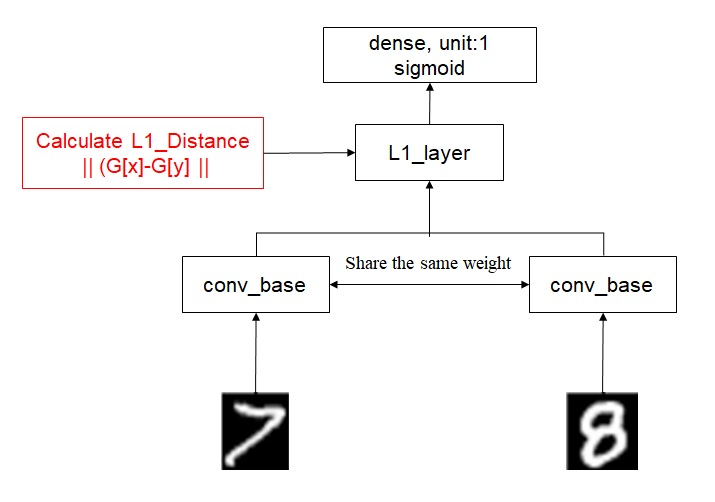

```{r setup, include=FALSE}
knitr::opts_chunk$set(echo = FALSE)
```
## 1. Learning algorithm with limited data

Traditional machine learning algorithms, including classic and advanced, require large amounts of labelled data for training. However, in real world, obtaining such data can be expensive, time-consuming, or even impossible. Zero-, one- and few-shot learning algorithms are designed to address the challenge of learning from limited labelled data. Each approach refers to the number of examples available for training and the level of generalization required.

### 1.1 Zero-Shot Learning

The model is designed to train with no examples for certain classes. It has the two following characteristics.

- Generalization: The goal is to classify instances from classes not seen during training. The model learns to generalize its knowledge to unseen classes.
- Common Technique: Transfer learning, semantic embeddings, and attribute-based methods are often used in zero-shot learning. These approaches leverage auxiliary information about classes to perform classification.

### 1.2 One-Shot Learning

The model is designed to train with just one example per class. It has the following charateristics.

- Generalization: The goal is to learn a representation that can differentiate between classes based on a single example.
- Common Technique: **Siamese**, **matching**, and **prototypical** networks are often used in one-shot learning. These architectures focus on learning relationships between examples.

### 1.3 Few-Shot Learning

This is a more general term that encompasses both one-shot learning and scenarios where a small number of examples (more than one) per class are available. It has the following charateristics.

- Generalization: The goal is to enable the model to classify instances from classes with very few training examples.
- Common Techniques: These methods include variants of one-shot learning models and meta-learning strategies. These techniques teach the ability to adapt quickly to new tasks or classes.

## 2. Building a one-shot learning model

We can learn the basics of Keras by walking through a simple example of the MNIST dataset. It consists of 28 x 28 grayscale images of handwritten digits. The dataset includes labels for each image, telling us which digit it is. For machine learning, such as ANN, with the dataset, please visit [the site](https://rpubs.com/garynth41/546355) and [another one](https://www.kaggle.com/code/blastchar/digit-recognizer-using-keras-2)

Here we build one-shot learning model with a dataset of mnist number. The code modified according to [this page](https://tensorflow.rstudio.com/tutorials/keras/classification).

### 2.1 Loading and spliting data

First, we load and split the data into training, validation, and testing sets using the Keras and abind libraries in R. Here's the code:

```{r echo=TRUE}
# # the first three lines should be run for checking the python env
# # rm(list = ls())
# # library(reticulate) # loading virtual environment for project
# # py_config() # By default, the env is ~/.virtualenvs/r-reticulate
# library(reticulate)
# library(keras) # loading the package for data and modelling
# library(abind) # operating multidimensional arrays, which are often expressed any image.
# # mnist <- dataset_mnist() # load the dataset from the keras package
# # np <- import(numpy)
# # mnist <- np$load("/home/tank/Desktop/ecodatasci/images/mnist.npz") # full path
# mnist <- dataset_mnist("/home/tank/Desktop/ecodatasci/images/mnist.npz") # full path
```

Let’s explore the format of the dataset before training the model. 

```{r echo=TRUE}
# str(mnist)
```

We have four arrays: train_images and train_labels, test_images and test_labels. We can separate each array from each other by performing the following code.

```{r echo=TRUE}
# train_images1 <- mnist$train$x
# train_labels1 <- mnist$train$y
# test_images  <- mnist$test$x 
# test_labels  <- mnist$test$y
```

train_images1 contain 60,000 images. Each image shows 28 x 28 pixels, which values ranging between 0 and 255. train_labels1 with 60000 elements are arrays of integers, ranging from 0 to 9. 

```{r echo=TRUE}
# dim(train_images1)
# dim(train_labels1)
# train_labels1[1:20]
```

test_images contain 10000 images, which is used to evaluate how accurately the network learned. Each image is represented as 28 x 28 pixels.

```{r echo=TRUE}
# dim(test_images)
# dim(test_labels)
```

Using Keras, we can set aside a portion of the training data for validation. This helps monitor model performance and detect overfitting. At the point, we have 48,000 training. Additional 12,000 data are validation.

```{r echo=TRUE}
# set.seed(9478)
# val_idx      <- sample(1:nrow(train_images1),
#             size = ceiling(0.2*nrow(train_images1)), # the smallest integer > the value
#                        replace = F)
# val_images   <- train_images1[val_idx,,] # the third comma means the channel of accolor image
# val_labels   <- train_labels1[val_idx]
# train_images <- train_images1[-val_idx,,]
# train_labels <- train_labels1[-val_idx]
```

The pixel values fall in the range of 0 to 255. We scale pixel values to a range of 0 (black) to 1 (white) before feeding to model. You can visualize the mnist's data as blow. The title is its label and image is its array.

```{r echo=TRUE}
# par(mar = c(0,0,4,0)) # seting the bottom, left, top and right margins of a plot region.
# i <- 1
# plot(as.raster(train_images[i,,]/255)) # i and two comma denote 3-dimensional array of an image
# title(train_labels[i])
```

### 2.2 Building a self define generator

This step includes: setting parameters, building self define generator, building self define layer, building self define backend function.

#### Parameter Setting

In any machine learning model, you would typically need to set various parameters for configuring the model. 

```{r echo=TRUE}
# num_classes  <- 10 # only number : 0,1,2,3,4,5,6,7,8,9 
# shape_size   <- 28 # mnist shape (28,28)
# train_batch  <- 20 
# val_batch    <- 20 
# test_batch   <- 1
```

We create train_data_list and val_data_list to hold the training and validation data.The code is a general template for organizing and reshaping data for using Keras. It can be adapted to other datasets with modifications to class labels, images, and dimensions.

```{r echo=TRUE}
# train_data_list    <- list() 
# grp_kind     <- sort(unique(train_labels)) # # get unique class labels from data 
#   for( grp_idx in 1:length(grp_kind)) { # iterate over each class, grp_idx = 1,  
#     label    <- grp_kind[grp_idx]  # get label of the current class  
#     tmp_images <- train_images[train_labels==label,,] # get images of the current class 
#     tmp_images     <- array(tmp_images, dim = c(dim(tmp_images), 1))  # reshape to 4D (batch_size, height, width, channels) for keras's generator.  
#     train_data_list[[grp_idx]] <- list( data  = tmp_images, # x                   
#                                         label = train_labels[train_labels==label])# y
#   }  
# 
# val_data_list      <- list() 
# grp_kind     <- sort( unique( val_labels ) )   
#   for( grp_idx in 1:length(grp_kind) ) { # grp_idx = 1     
#     label                      <- grp_kind[grp_idx]     
#     tmp_images                 <- val_images[val_labels==label,,]     
#     tmp_images                 <- array( tmp_images , dim = c( dim(tmp_images) , 1) )     
#     val_data_list[[grp_idx]]   <- list( data  = tmp_images ,                                         
#                                         label = val_labels[val_labels==label]      
#                                       )   
#   }
```

To determine the exact number of samples for each class, you can inspect the length of the list within the train_data_list. That is, using length(train_data_list[[1]]$lebal) gives you the number of samples for the first class. You can repeat this for each class to get the number of samples for each class.

```{r echo=TRUE}
# # Initialize a variable to store the sum
# total_sum <- 0
# 
# # Use a for loop to sum values from 1 to 10
# for (i in 1:10) {
#   counts <- length(train_data_list[[i]]$label)
#   total_sum <- total_sum + counts
# }
# 
# # Print the total sum
# cat("The sum of values from 1 to 10 is:", total_sum, "\n")
```

#### Self a define generator

Data augmentation is a technique to increase the diversity of your training dataset by applying various transformations to images, and improves the model's generalization and robustness. Here we first build generators with image_data_generator for each mnist's number to generalize the number, and then collect all numbers' generators into a list. 

```{r echo=TRUE}
# train_datagen = image_data_generator( # data argumentation
#   rescale = 1/255          , # scaling pixel values to the range [0, 1]
#   rotation_range = 5       , # randomly rotate images by up to 5 degrees
#   width_shift_range = 0.1  , # shift by up to 10% of the image's width
#   height_shift_range = 0.05, # shift by up to 5% of the image's height
#   #shear_range = 0.1,
#   zoom_range = 0.1         , # randomly zoom in/out by up to 10%
#   horizontal_flip = FALSE  , # disable horizontal flipping
#   vertical_flip = FALSE    , # disable vertical flipping
#   fill_mode = "constant"     # fill mode for new pixels (constant value)
# )
```

We will train the model to differentiate between digits of different classes. For example, digit 0 needs to be differentiated from the rest of the digits (1 through 9). To carry this out, we will select N random images from class A (for example, for digit 0) and pair them with N random images from another class B (for example, for digit 1). The following code prepares data generators for individual classes, making it easier to handle and process data during training and validation. It is especially useful for one-shot learning tasks.

```{r echo=TRUE}
# train_0_generator <- flow_images_from_data( # for 0 number
#   x = train_data_list[[1]]$data  ,   
#   y = train_data_list[[1]]$label ,   
#   train_datagen                  , # data augmentation configuration  
#   shuffle = TRUE                 ,   
#   seed = 9487                    ,   
#   batch_size = 1  # for one-shot learning, each batch contains one pair of images 
# )
# 
# train_1_generator <- flow_images_from_data( # for 1 number  
#   x = train_data_list[[2]]$data  ,   
#   y = train_data_list[[2]]$label ,   
#   train_datagen                  ,   
#   shuffle = TRUE                 ,   
#   seed = 9487                    ,   
#   batch_size = 1 
# )
# 
# train_2_generator <- flow_images_from_data( # for 2 number  
#   x = train_data_list[[3]]$data  ,   
#   y = train_data_list[[3]]$label ,   
#   train_datagen                  ,   
#   shuffle = TRUE                 ,   
#   seed = 9487                    ,   
#   batch_size = 1 
# )
# 
# train_3_generator <- flow_images_from_data( # for 3 number  
#   x = train_data_list[[4]]$data  ,   
#   y = train_data_list[[4]]$label ,   
#   train_datagen                  ,   
#   shuffle = TRUE                 ,   
#   seed = 9487                    ,   
#   batch_size = 1 
# )
# 
# train_4_generator <- flow_images_from_data( # for 4 number  
#   x = train_data_list[[5]]$data  ,   
#   y = train_data_list[[5]]$label ,   
#   train_datagen                  ,   
#   shuffle = TRUE                 ,   
#   seed = 9487                    ,   
#   batch_size = 1 
# )
# 
# train_5_generator <- flow_images_from_data( # for 5 number  
#   x = train_data_list[[6]]$data  ,   
#   y = train_data_list[[6]]$label ,   
#   train_datagen                  ,   
#   shuffle = TRUE                 ,   
#   seed = 9487                    ,   
#   batch_size = 1 
# )
# 
# train_6_generator <- flow_images_from_data( # for 6 number  
#   x = train_data_list[[7]]$data  ,   
#   y = train_data_list[[7]]$label ,   
#   train_datagen                  ,   
#   shuffle = TRUE                 ,   
#   seed = 9487                    ,   
#   batch_size = 1 
# )
# 
# train_7_generator <- flow_images_from_data( # for 7 number  
#   x = train_data_list[[8]]$data  ,   
#   y = train_data_list[[8]]$label ,   
#   train_datagen                  ,   
#   shuffle = TRUE                 ,   
#   seed = 9487                    ,   
#   batch_size = 1 
# )
# 
# train_8_generator <- flow_images_from_data( # for 8 number   
#   x = train_data_list[[9]]$data  ,   
#   y = train_data_list[[9]]$label ,   
#   train_datagen                  ,   
#   shuffle = TRUE                 ,   
#   seed = 9487                    ,   
#   batch_size = 1 
# )
# 
# train_9_generator <- flow_images_from_data( # for 9 number   
#   x = train_data_list[[10]]$data ,   
#   y = train_data_list[[10]]$label,   
#   train_datagen                  ,   
#   shuffle = TRUE                 ,   
#   seed = 9487                    ,   
#   batch_size = 1 
# )
# 
# val_test_datagen = image_data_generator(
#   rescale = 1/255
# )
# 
# val_0_generator <- flow_images_from_data( # for 0 number  
#   x = val_data_list[[1]]$data    ,   
#   y = val_data_list[[1]]$label   ,   
#   train_datagen                  ,   
#   shuffle = TRUE                 ,   
#   seed = 9487                    ,   
#   batch_size = 1 
# )
# 
# val_1_generator <- flow_images_from_data( # for 1 number  
#   x = val_data_list[[2]]$data    ,   
#   y = val_data_list[[2]]$label   ,   
#   train_datagen                  ,   
#   shuffle = TRUE                 ,   
#   seed = 9487                    ,   
#   batch_size = 1 
# )
# 
# val_2_generator <- flow_images_from_data( # for 2 number   
#   x = val_data_list[[3]]$data    ,   
#   y = val_data_list[[3]]$label   ,   
#   train_datagen                  ,   
#   shuffle = TRUE                 ,   
#   seed = 9487                    ,   
#   batch_size = 1 
# )
# 
# val_3_generator <- flow_images_from_data( # for 3 number   
#   x = val_data_list[[4]]$data    ,   
#   y = val_data_list[[4]]$label   ,   
#   train_datagen                  ,   
#   shuffle = TRUE                 ,   
#   seed = 9487                    ,   
#   batch_size = 1 
# )
# 
# val_4_generator <- flow_images_from_data( # for 4 number   
#   x = val_data_list[[5]]$data    ,   
#   y = val_data_list[[5]]$label   ,   
#   train_datagen                  ,   
#   shuffle = TRUE                 ,   
#   seed = 9487                    ,   
#   batch_size = 1 
# )
# 
# val_5_generator <- flow_images_from_data( # for 5 number  
#   x = val_data_list[[6]]$data    ,   
#   y = val_data_list[[6]]$label   ,   
#   train_datagen                  ,   
#   shuffle = TRUE                 ,   
#   seed = 9487                    ,   
#   batch_size = 1 
# )
# 
# val_6_generator <- flow_images_from_data( # for 6 number  
#   x = val_data_list[[7]]$data    ,   
#   y = val_data_list[[7]]$label   ,   
#   train_datagen                  ,   
#   shuffle = TRUE                 ,   
#   seed = 9487                    ,   
#   batch_size = 1 
# )
# 
# val_7_generator <- flow_images_from_data( # for 7 number  
#   x = val_data_list[[8]]$data    ,   
#   y = val_data_list[[8]]$label   ,   
#   train_datagen                  ,   
#   shuffle = TRUE                 ,   
#   seed = 9487                    ,   
#   batch_size = 1 
# )
# 
# val_8_generator <- flow_images_from_data( # for 8 number  
#   x = val_data_list[[9]]$data    ,   
#   y = val_data_list[[9]]$label   ,   
#   train_datagen                  ,   
#   shuffle = TRUE                 ,   
#   seed = 9487                    ,   
#   batch_size = 1 
# )
# 
# val_9_generator <- flow_images_from_data( # for 9 number  
#   x = val_data_list[[10]]$data   ,   
#   y = val_data_list[[10]]$label  ,   
#   train_datagen                  ,   
#   shuffle = TRUE                 ,   
#   seed = 9487                    ,   
#   batch_size = 1 
# )
```

The following code is responsible for generating pairs of data samples for one-shot learning, where half of the pairs are from the same class (positive) and the other half are from different classes (negative). It does so by selecting classes and fetching data samples from their corresponding generators. The following code is to create a data generator that generates pairs of data samples and their associated similarity labels for training a siamese neural network.

```{r echo=TRUE}
# # creating sample pairs from the same and different classes
# train_generator_list <- list(
#   train_0_generator ,
#   train_1_generator ,
#   train_2_generator ,
#   train_3_generator ,
#   train_4_generator ,
#   train_5_generator ,
#   train_6_generator ,
#   train_7_generator ,
#   train_8_generator ,
#   train_9_generator 
# )
# 
# val_generator_list <- list(
#   val_0_generator   ,
#   val_1_generator   ,
#   val_2_generator   ,
#   val_3_generator   ,
#   val_4_generator   ,
#   val_5_generator   ,
#   val_6_generator   ,
#   val_7_generator   ,
#   val_8_generator   ,
#   val_9_generator 
# )
# 
# join_generator <- function(generator_list, batch) { 
#   function() { 
#     batch_left  <- NULL 
#     batch_right <- NULL 
#     similarity  <- NULL 
#       for( i in seq_len(batch)) { # i = 1 
#           if( i <= ceiling(batch/2)) { # front half
#             grp_same    <- sample(seq_len(num_classes), 1) # randomly sampling one class
#             # combining array vertically
#             batch_left  <- abind(batch_left, generator_next(generator_list[[grp_same]])[[1]], along = 1) 
#             batch_right <- abind(batch_right, generator_next(generator_list[[grp_same]])[[1]], along = 1)
#             similarity  <- c(similarity, 1) # 1 : from the same number
#             # par(mar = c(0,0,4,0))
#             # plot(as.raster(batch_left[21,,,]))
#             # title(batch_left[[2]])
#           } else { # after half 
#             grp_diff    <- sort(sample(seq_len(num_classes) , 2)) 
#             batch_left  <- abind(batch_left, generator_next(generator_list[[grp_diff[1]]])[[1]], along = 1) 
#             batch_right <- abind(batch_right, generator_next(generator_list[[grp_diff[2]]])[[1]], along = 1) 
#             similarity  <- c( similarity , 0 ) # 0 : from the differnet number
#           } 
#       } 
#     return(list(list(batch_left, batch_right), similarity)) 
#   } 
# }
# 
# train_join_generator   <- join_generator( train_generator_list, train_batch )
# val_join_generator     <- join_generator( val_generator_list  , val_batch   )
```

### 2.3 Building and training a model

#### the siamese architecture

In one-shot learning, the model is trained to recognize new objects or classes with only a single example per class. There are several architectures of one-shot learning, including **Siamese**, **matching**, and **prototypical** networks.

- **Siamese Networks**: Siamese networks involve training a neural network to learn a similarity metric between pairs of input examples. This allows the network to distinguish between similar and dissimilar instances, making it suitable for one-shot learning tasks in conversion ecology, such as species recognition, identifying plant diseases. 

- **Matching Networks**: Matching networks combine the concepts of attention mechanisms and recurrent networks to make predictions based on a context set of examples. These networks learn to weigh the importance of each sample in the context when making predictions for a new instance.

- **Prototypical Networks**: Prototypical networks learn a prototype representation for each class based on a few examples. During testing, new samples are compared to these prototypes to make predictions.

We build simple convolution as conv_base and let two images use the same conv_base model which share the same weight (see the figure).

<br>
<center>

</center>
</br>

#### building model with siamese

The code for building the one-shot learning with siamese is as follows.

```{r echo=TRUE}
# left_input_tensor      <- layer_input(shape = list(shape_size, shape_size, 1), name = "left_input_tensor")
# right_input_tensor     <- layer_input(shape = list(shape_size, shape_size, 1), name = "right_input_tensor")
# 
# conv_base              <- keras_model_sequential()           %>%
#   layer_flatten(input_shape=list(shape_size, shape_size, 1)) %>%
#   layer_dense(units = 128, activation = "relu", name='fc1')  %>%
#   layer_dropout(rate = 0.1, name='dropout1')                 %>%
#   layer_dense(units = 128, activation = "relu", name='fc2')  %>% 
#   layer_dropout(rate = 0.1, name='dropout2')                 %>%
#   layer_dense(units = 128, activation = "relu", name='fc3')
# 
# left_output_tensor     <- left_input_tensor  %>%   
#                           conv_base  
# 
# right_output_tensor    <- right_input_tensor %>%   
#                           conv_base  
# 
# L1_distance <- function(tensors) { # build keras backend's function  
#   c(x,y) %<-% tensors   
#   return( k_abs( x - y ) ) 
# }       
# 
# L1_layer    <- layer_lambda( object = list(left_output_tensor,right_output_tensor) , # To build self define layer, you must use layer_lamda                                
#                              f = L1_distance                              
#                            )   
# 
# prediction  <- L1_layer%>%                
#                layer_dense( units = 1 , activation = "sigmoid" )  
# 
# model       <- keras_model( list(left_input_tensor,right_input_tensor), prediction)
```

#### training the model

During training, the model is exposed to pairs of examples. For each pair, one example is treated as the “query” example, and the other is treated as a “support” or “reference” example. The model learns to differentiate between similar and dissimilar pairs. It learns to embed the examples so that similar examples are close in the embedding space and distinct examples are far apart. The learning rate (1e-5) will lead to slowly optimize progress, so we suggest use 1e-3 as our learning rate. Below is comparison, you will find 1e-3 is learning faster than 1e-5 more.

```{r echo=TRUE}
# model %>% compile(
#   loss      = "binary_crossentropy",
#   optimizer = optimizer_rmsprop(learning_rate = 1e-3),
#   metrics   = c("accuracy")
# )
# 
# history <- model %>% fit_generator(
#   train_join_generator,
#   steps_per_epoch = 100,
#   epochs = 40,
#   validation_data = val_join_generator,
#   validation_steps = 50
# )
# 
# plot(history)
```

### 2.4 Verifing with test data

#### Same number match

After training, the model’s performance is evaluated on new, unseen examples. To make predictions, the model typically calculates distances or similarities between the embeddings of the query example and the support examples. The class associated with the closest support example is predicted as the class for the query example.

```{r echo=TRUE}
# # same number
# mnist_number_left  <- 8
# filter_idx_left    <- sample( which( test_labels == mnist_number_left  ) , 1 )
# img_input_left     <- test_images[filter_idx_left ,,]/255
# mnist_number_right <- 8
# filter_idx_right   <- sample( which( test_labels == mnist_number_right ) , 1 )
# img_input_right    <- test_images[filter_idx_right,,]/255
# img_input_left     <- array_reshape(img_input_left , c(1, shape_size, shape_size, 1))
# img_input_right    <- array_reshape(img_input_right, c(1, shape_size, shape_size, 1))
# 
# similarity         <- model %>% predict(list(img_input_left,img_input_right))
# par(mar = c(0,0,4,0))
# plot( as.raster( abind(img_input_left[1,,,] ,
#                        img_input_right[1,,,],
#                        along = 2
#                       ) 
#                ) 
# )
# title( paste0( test_labels[filter_idx_left] , " v.s " , test_labels[filter_idx_right] , " , similarity : " , round(similarity,3) ) )
```

#### Different number match

```{r echo=TRUE}
# # different number
# mnist_number_left  <- 8
# filter_idx_left    <- sample( which( test_labels == mnist_number_left  ) , 1 )
# img_input_left     <- test_images[filter_idx_left ,,]/255
# mnist_number_right <- 7
# filter_idx_right   <- sample( which( test_labels == mnist_number_right ) , 1 )
# img_input_right    <- test_images[filter_idx_right,,]/255
# img_input_left     <- array_reshape(img_input_left , c(1, shape_size, shape_size, 1))
# img_input_right    <- array_reshape(img_input_right, c(1, shape_size, shape_size, 1))
# 
# similarity         <- model %>% predict(list(img_input_left,img_input_right))
# par(mar = c(0,0,4,0))
# plot( as.raster( abind(img_input_left[1,,,] ,
#                        img_input_right[1,,,],
#                        along = 2
#                       ) 
#                ) 
#     )
# title( paste0( test_labels[filter_idx_left] , " v.s " , test_labels[filter_idx_right] , " , similarity : " , round(similarity,3) ) )
```