```{r setup, include=FALSE}
knitr::opts_chunk$set(echo = FALSE)
```

## 1. Basically stacking layers

### 1.1 Convolution on an image

CNN is designed for image recognition. They can capture the spatial characteristics of an image. They work in a way like this. 

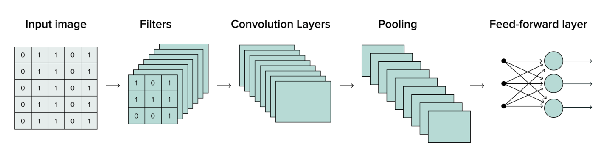{width=100% heigh=200% .external}

The architectures contain three kinds of layers: convolutional layer, pooling layer, and fully-connected layer. For details about how each layer works, see [here](https://serokell.io/blog/introduction-to-convolutional-neural-networks), as well as [others](https://stanford.edu/~shervine/teaching/cs-230/cheatsheet-convolutional-neural-networks).

There is much information about CNN conception. You can watch [this video](https://www.youtube.com/watch?v=__6WSqmlJRk&t=10s).

Let's take a look this imagine. It has 8x8 pixels, the values of which range from 0 to 255, representing black and white, respectively. For convolution on the imagine, see the box1. 

<div class="warning" style='padding:0.1em; background-color:#E9D8FD; color:#69337A'>
<span>
<p style='margin-top:1em; text-align:center'>
<b>Box 1: Convoluting on an imagine</b></p>
<p style='margin-left:1em;'>

**convolution operation**: Convolution is a fundamental operation in image processing because it is a highly effective way to extract features and filter noise from images. The convolution operation involves sliding the filter over the image, computing the dot product between the filter and the corresponding image pixels at each position, and assigning the result to the central pixel of the filter.

<br>
<center>
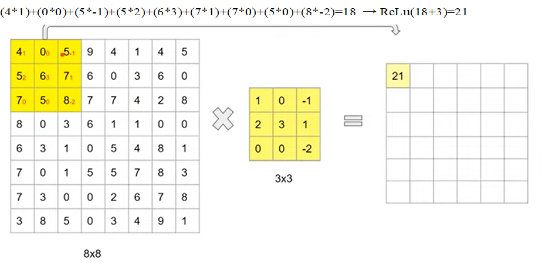{width=80%}
</center>
</br>
You can use multiple filters extract pixel values for getting multiple feature maps, other than only one.

<br>
<center>
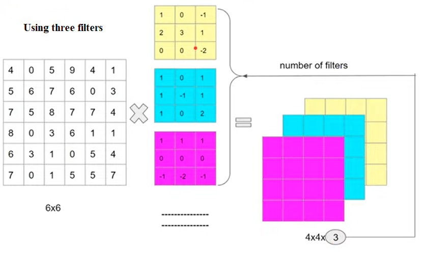{width=80%}
</center>
</br>

If convolution on a color image (i.e., RGB, three channels), you should select a filter with same channels to combined their values for a feature map like this.

<br>
<center>
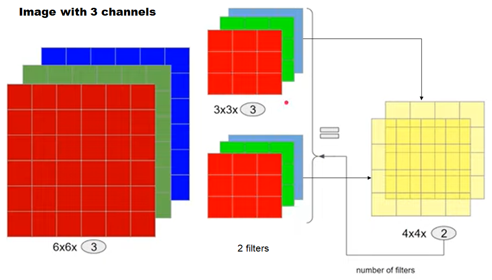{width=80%}
</center>
</br>

For the convolution operation, you should notice the padding and stride. Padding and stride are two techniques used to improve convolutions operations and make the more efficient. 

**padding**: CNNs commonly use convolution filters with odd height and width values, such as 1, 3, 5, or 7 to  avoid undesirable shrinkage of original imagines.

<br>
<center>
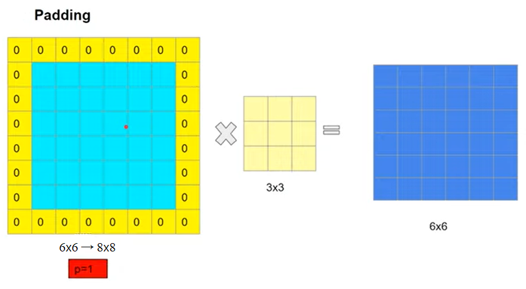{width=80%}
</center>
</br>

**stride**: The amount of movement between applications of the filter to the input image is referred to as the stride. The stride of the filter on the input image can be used to downsample the size of the output feature map.

<br>
<center>
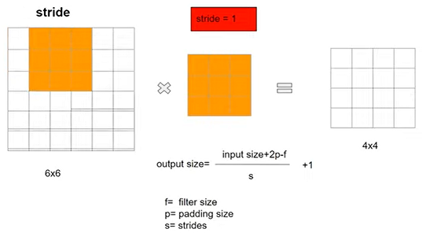{width=80%}
</center>
</br>

</p>
<p style='margin-bottom:1em; margin-right:1em; text-align:right; font-family:Georgia'> </p></span>
</div>
<br>

### 1.2 Pooling operation

After extracting features with filters, you can reduce data dimension and emphasize features by pooling layers (see the box7).

<div class="warning" style='padding:0.1em; background-color:#E9D8FD; color:#69337A'>
<span>
<p style='margin-top:1em; text-align:center'>
<b>Box 2: Pooling on a feature map</b></p>
<p style='margin-left:1em;'>

**pooling operation**: The pooling operation involves sliding a two-dimensional filter over each feature map and summarizing the features lying within the region covered by the filter.  This makes the model more robust to variations in the position of the features in the input image. 

<br>
<center>
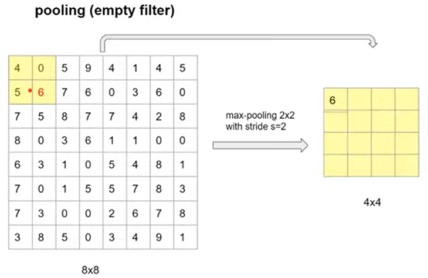{width=80%}
</center>
</br>

</p>
<p style='margin-bottom:1em; margin-right:1em; text-align:right; font-family:Georgia'> </p></span>
</div>
<br>

### 1.3 Flattening and activation functions

After convolution and pooling steps, we are literally going to flatten our pooled feature map into a column like in the image below to feed ANN later on.

<div class="warning" style='padding:0.1em; background-color:#E9D8FD; color:#69337A'>
<span>
<p style='margin-top:1em; text-align:center'>
<b>Box 3: Flattening for a columon</b></p>
<p style='margin-left:1em;'>

Basically, flattening just takes the numbers row by row, and put them into this one long column.

<br>
<center>
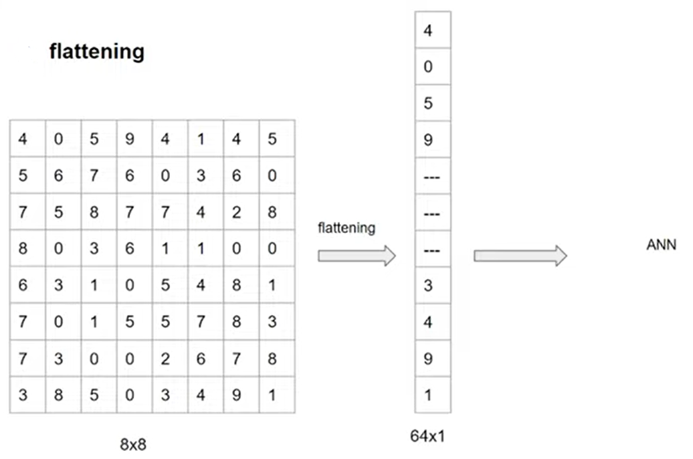{width=80%}
</center>
</br>

**Activation function**: First note that the hidden and output layers usually have activation functions such as sigmoid, tanh, ReLU, identity, etc. Activation functions in hidden layers are usually nonlinear, e.g. ReLU (rectified linear unit), which is a piecewise linear function that introduces the most simple nonlinearity. ReLU  Those in an output layer used are linear function g(z)=z, such as softmax.  

<br>
<center>
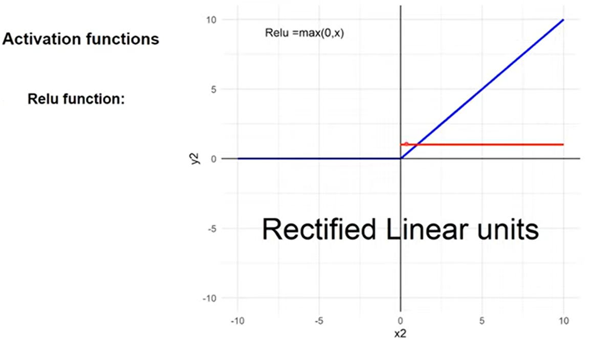{width=60%}
</center>
</br>

</p>
<p style='margin-bottom:1em; margin-right:1em; text-align:right; font-family:Georgia'> </p></span>
</div>
<br>

## 2. Building and training CNN Model

### 2.1 Designing CNN model

Now there have some pictures of animals with dogs, cats and loans. There are many architectures for image classification, one of the most popular being CNN. CNN is especially effective at image classification because they are able to automatically learn the spatial hierarchies of features, such as edges, textures, and shapes, which are important for recognizing objects in images.

We define CNN architecture using the Keras library. The model consists of several convolutional layers followed by max pooling layers, and a fully connected layer with a softmax activation function (see the box4).

<div class="warning" style='padding:0.1em; background-color:#E9D8FD; color:#69337A'>
<span>
<p style='margin-top:1em; text-align:center'>
<b>Box 4: Designing a CNN model</b></p>
<p style='margin-left:1em;'>

Here is a CNN architecture for the classification of animal picture.
<br>
<center>
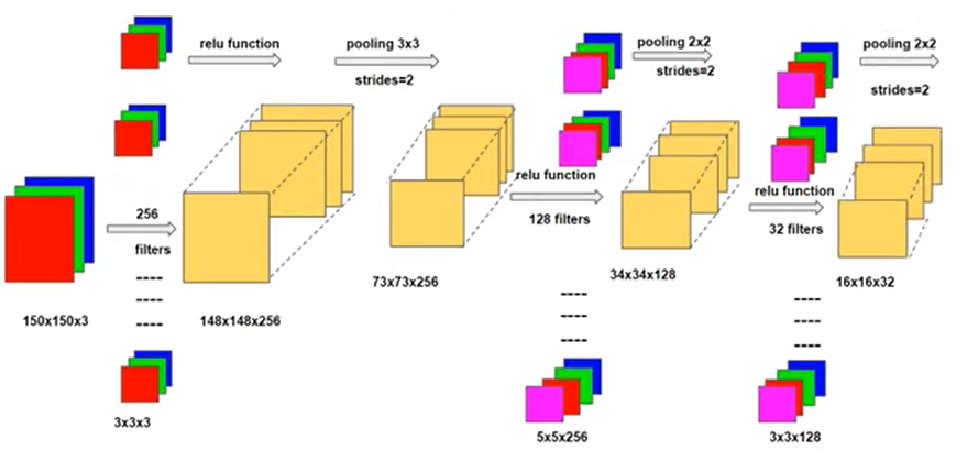{width=90%}

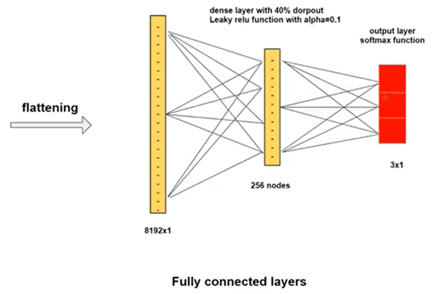{width=90%}
<center>
</br>
</p>
<p style='margin-bottom:1em; margin-right:1em; text-align:right; font-family:Georgia'> </p></span>
</div>
<br>

### 2.2 Defining and training CNN model

For the code, please visit [the website](https://github.com/Metalesaek/image-classification)

## 3. An example of a CNN model

The main code is modified from [the website](https://rpubs.com/syabaruddin/Image_Classification_with_Convulotional_Neural_Network_using_Keras_API), [the website](https://www.r-bloggers.com/2020/09/update-with-tf-2-0-image-classification-with-keras-and-tensorflow/#google_vignette) and [the website](https://rpubs.com/rusdipermana/image-cl).

### 3.1 Preparing data with generator

In this context, we import a number of libraries that provide specific tools and functions for each stage of our project. These libraries not only facilitate our work, but also ensure that we can make the most of their advanced features. Here are some of the libraries we import.

```{r echo=TRUE}
# library(tidyverse) # Data wrangling
# library(imager) # Image manipulation
# library(keras) # Deep learning
# library(caret) # Model Evaluation
```

#### 3.1.1 Data list and path

Image processing is a crucial step. In this stage, raw images need to be processed to make them suitable for use in the desired model, involving image preprocessing, resizing to uniform dimensions, normalizing pixel intensities. Additionally, image augmentation can be performed to enhance data variability and diversity.

```{r echo=TRUE}
# rm(list = ls())
# 
# # path to images
# train_folder_list <- list.files("fruits-360/Training/") # image folders
# train_folder_list
# train_images_list <- c("Kiwi", "Banana", "Apricot") # list of images
# train_images_path <- paste0("fruits-360/Training/", train_images_list, "/")
# train_images_path
# 
# # get file name
# train_file_name <- map(train_images_path, function(x) paste0(x, list.files(x))) %>% unlist()
# head(train_file_name) # first 6 file name
# tail(train_file_name) # last 6 file name
# length(train_file_name)
# 
# # Plot image
# set.seed(123)
# sample_image <- sample(train_file_name, 6) # Randomly select image
# img <- map(sample_image, load.image) # Load image into R
# par(mfrow = c(2, 3)) # Create 2 x 3 image grid
# map(img, plot) # Plot image
```

#### 3.1.2 Checking and uniforming data

We need to check the image dimension and create a proper input dimension for building the deep learning model. 

```{r echo=TRUE}
# img <- load.image(train_file_name[1]) # First Image 
# img
# dim(img) # get the value of each dimension
```

Now let’s create a function that will automatically get the height and width of an image and convert it into a dataframe.

```{r echo=TRUE}
# # automatically for acquiring width and height of an image
# get_dim <- function(x){
#   img <- load.image(x) 
#   df_img <- data.frame(height = height(img),
#                        width = width(img),
#                        filename = x)
#   return(df_img)
# }
# get_dim(train_file_name[1])
# 
# # automatically for acquiring width and height of all images
# set.seed(123)
# sample_file <- sample(train_file_name) # Randomly get 1328 sample images
# file_dim <- map_df(sample_file, get_dim) # Run the get_dim() for each image
# head(file_dim, 10)
# summary(file_dim)
```

Let's resize to uniform dimensions. The dimensions must not too small to avoid any lost data information, and also not too big to avoid very slow training time. The configuration of batches helps optimize memory usage and computational efficiency during the training process.

```{r echo=TRUE}
# # image size to scale down to (original images are 100 x 100 px)
# img_width <- 20
# img_height <- 20
# target_size <- c(img_width, img_height)
# 
# # RGB = 3 channels
# channels <- 3

# define batch size
# batch_size <- 32
```

#### 3.1.3 Spliting dataset

Normalizing pixel intensities, combined with rescaling and validation splitting, can contributes to creating a more robust and diverse dataset for training. We use the train_data_gen generator() to prepares data with the transformations.

```{r echo=TRUE}
# set.seed(100)
# # Image Generator
# train_data_gen <- 
#   image_data_generator(rescale = 1/255, # Scaling pixel value
#                        horizontal_flip = T, # Flip image horizontally
#                        vertical_flip = T, # Flip image vertically 
#                        rotation_range = 45, # Rotate image from 0 to 45 degrees
#                        zoom_range = 0.25, # Zoom in or zoom out range
#                        validation_split = 0.2, # 20% data as validation data
#                        fill_mode = "nearest")
```

Now we can insert our image data into the data generator using the flow_images_from_directory().

```{r echo=TRUE}
# # Training Dataset
# train_image_array_gen <- 
#   flow_images_from_directory(directory = "fruits-360/Training/", 
#                              classes = train_images_list,
#                              target_size = target_size, # the image dimension  
#                              color_mode = "rgb", # use RGB color
#                              batch_size = batch_size , 
#                              seed = 123,  # set random seed
#                              subset = "training", # declare it for training data
#                              generator = train_data_gen)
# 
# # Validation Dataset
# val_image_array_gen <- 
#   flow_images_from_directory(directory = "fruits-360/Training/",
#                              target_size = target_size, 
#                              classes = train_images_list,
#                              color_mode = "rgb", 
#                              batch_size = batch_size ,
#                              seed = 123,
#                              subset = "validation", # declare it as validation
#                              generator = train_data_gen)
```
Balance target classes is very important for classification task. Here we check the class proportion of the train dataset. Our target classes/labels proportion is balance enough.

```{r echo=TRUE}
# # Number of training samples
# train_samples <- train_image_array_gen$n
# # Number of validation samples
# valid_samples <- val_image_array_gen$n
# # Number of target classes/categories
# output_n <- n_distinct(train_image_array_gen$classes)
# # Get the class proportion
# table("\nFrequency" = factor(train_image_array_gen$classes)) %>% 
#   prop.table()
```

### 3.2 Training and turning model

#### 3.2.1 Model architecture

We can start building the model architecture for the deep learning. We will build a simple model first with the following layer:

- Convolutional layer to extract features from 2D image with relu activation function
- Max Pooling layer to downsample the image features
- Flattening layer to flatten data from 2D array to 1D array
- Dense layer to capture more information
- Dense layer for output with softmax activation function

Don’t forget to set the input size in the first layer. If the input image is in RGB, set the final number to 3. If the input image is in grayscale, set the final number to 1.

```{r echo=TRUE}
# # input shape of the image
# c(target_size, 3) 
# model <- keras_model_sequential() %>% 
#   # Convolution Layer
#   layer_conv_2d(filters = 32,
#                 kernel_size = c(3,3),
#                 padding = "same",
#                 activation = "relu",
#                 input_shape = c(target_size, 3) 
#                 ) %>% 
#   # Max Pooling Layer
#   layer_max_pooling_2d(pool_size = c(2,2)) %>% 
#   # Flattening Layer
#   layer_flatten() %>% 
#   # Dense Layer
#   layer_dense(units = 32, activation = "relu") %>% 
#   # Output Layer
#   layer_dense(units = output_n, activation = "softmax", name = "Output")
#   
# model
```

#### 3.2.2 Model Fitting

We start fitting the data into the model. For starter, we will use 30 epochs to train the data. For multilabel classification, we use categorical cross-entropy as the loss function. We will also evaluate the model with the validation data from the generator.

```{r echo=TRUE}
# model %>% 
#   compile(
#     loss = "categorical_crossentropy",
#     optimizer = optimizer_adam(),
#     metrics = "accuracy"
#   )
# 
# # Fit data into model
# history <- model %>% 
#   fit(
#   # training data
#   train_image_array_gen,
#   # training epochspp
#   steps_per_epoch = as.integer(train_samples / batch_size), 
#   epochs = 30, 
#   # validation data
#   validation_data = val_image_array_gen,
#   validation_steps = as.integer(valid_samples / batch_size)
# )
# 
# plot(history)
```

#### 3.2.3 Model evaluation

Let’s evaluate the model using confusion matrix. First, we need to acquire the file name from the data validation. From the file name, we will extract the categorical label as the actual value of the target variable.

```{r echo=TRUE}
# val_data <- data.frame(
#   file_name = paste0("fruits-360/Training/", val_image_array_gen$filenames)) %>%
#   mutate(class = str_extract(file_name, "Kiwi|Banana|Apricot"))
# head(val_data, 10)
```

We need to get the image into R by converting the image into an array. Since our input dimension for CNN model is image with 20 x 20 pixels with 3 color channels (RGB). The reason of using array is that we want to predict the original image fresh from the folder, so we will not use the **image generator** since it will transform the image and does not reflect the actual image.

```{r echo=TRUE}
# # Function to convert image to array
# image_prep <- function(x) {
#   arrays <- lapply(x, function(path) {
#     img <- image_load(path, target_size = target_size, 
#                       grayscale = F) # Set FALSE if image is RGB
#     
#     x <- image_to_array(img)
#     x <- array_reshape(x, c(1, dim(x)))
#     x <- x/255 # rescale image pixel
#   })
#   do.call(abind::abind, c(arrays, list(along = 1)))
# }
# 
# test_x <- image_prep(val_data$file_name)
# # Check dimension of testing data set
# dim(test_x)
```

After we have prepared the data test, we now can proceed to predict the label of each image using our CNN model.

```{r echo=TRUE}
# # for muli-classes, using %>% k_argmax(), for binary classes, using %>% `>`(0.5) %>% k_cast("int32")
# pred_test_m <- predict(model, test_x) %>% k_argmax()
# 
# # Convert encoding to label
# decode <- function(x){
#   case_when(x == 0 ~ "Kiwi",
#             x == 1 ~ "Banana",
#             x == 2 ~ "Apricot")
# }
# 
# pred_test <- sapply(pred_test_m, decode) 
# pred_test
```

Now let’s evaluate using confusion matrix to check the accuracy and other metrics.

```{r echo=TRUE}
# confusionMatrix(as.factor(pred_test), 
#                 as.factor(val_data$class))
```

#### 3.2.4 Model Tuning

let’s check our model. We actually extract information from an 2D image array. The first layer only extract the general features of our image and then being downsampled using the max pooling layer. Therefore, we can stacks more layers in the model for capturing more information like this.

```{r echo=TRUE}
# # constructing model
# model_tuned <- keras_model_sequential() %>% 
#   # Convolution Layer
#   layer_conv_2d(filters = 32,
#                 kernel_size = c(3,3),
#                 padding = "same",
#                 activation = "relu",
#                 input_shape = c(target_size, 3)) %>% 
#   # Convolution Layer
#   layer_conv_2d(filters = 32,
#                 kernel_size = c(3,3),
#                 padding = "same",
#                 activation = "relu",
#                 input_shape = c(target_size, 3)) %>% 
#   # Max Pooling Layer
#   layer_max_pooling_2d(pool_size = c(2,2)) %>% 
#   # Flattening Layer
#   layer_flatten() %>% 
#   # Dense Layer
#   layer_dense(units = 16, activation = "relu") %>% 
#   # Output Layer
#   layer_dense(units = output_n,
#               activation = "softmax",
#               name = "Output")
#   
# model_tuned
# 
# # Fit data into model
# model_tuned %>% 
#   compile(
#     loss = "categorical_crossentropy",
#     optimizer = optimizer_adam(lr = 0.001),
#     metrics = "accuracy"
#   )
# 
# history <- model_tuned %>% 
#   fit(
#   # training data
#   train_image_array_gen,
#   # training epoch
#   steps_per_epoch = as.integer(train_samples / batch_size), 
#   epochs = 30, 
#   # validation data
#   validation_data = val_image_array_gen,
#   validation_steps = as.integer(valid_samples / batch_size))
# 
# plot(history)
# 
# # evaluating model
# pred_test_t <- predict(model_tuned, test_x) %>% k_argmax()
# # Convert encoding to label
# decode <- function(x){
#   case_when(x == 0 ~ "Kiwi",
#             x == 1 ~ "Banana",
#             x == 2 ~ "Apricot")
# }
# 
# pred_test <- sapply(pred_test_t, decode) 
# pred_test
# 
# confusionMatrix(as.factor(pred_test), 
#                 as.factor(val_data$class))
```

### 3.3 Prediction with CNN model

After we have trained the tuned-model and satisfied with the model performance on the validation dataset, we will do prediction/classification using new data test.

#### 3.3.1 Preparing data

As the previous section for preparing training data, let's do the same steps for test data.

```{r echo=TRUE}
# # List of test images
# test_folder_list <- list.files("fruits-360/Test/") # image folders
# test_folder_list
# test_images_list <- c("Kiwi", "Banana", "Apricot") # list of images
# test_images_path <- paste0("fruits-360/Test/", test_images_list, "/")
# test_images_path
# # get file name
# test_file_name <- map(test_images_path, function(x) paste0(x, list.files(x))) %>% unlist()
# length(test_file_name)
# 
# # Uniform and rescale 
# # image size to scale down to (original images are 100 x 100 px)
# img_width <- 20
# img_height <- 20
# target_size <- c(img_width, img_height)
# # RGB = 3 channels
# channels <- 3
# # define batch size
# batch_size <- 32
# 
# # Test image Generator
# test_data_gen <- 
#   image_data_generator(rescale = 1/255, # Scaling pixel value
#                        horizontal_flip = T, # Flip image horizontally
#                        vertical_flip = T, # Flip image vertically 
#                        rotation_range = 45, # Rotate image from 0 to 45 degrees
#                        zoom_range = 0.25)# Zoom in or zoom out range
# 
# test_image_array_gen <- 
#   flow_images_from_directory(directory = "fruits-360/Test/",
#                              classes = test_images_list,
#                              target_size = target_size, 
#                              color_mode = "rgb", 
#                              batch_size = batch_size ,
#                              seed = 123,
#                              generator = test_data_gen)
# 
# test_data <- data.frame(file_name = paste0("fruits-360/Test/", test_image_array_gen$filenames)) %>% 
#   mutate(class = str_extract(file_name, "Kiwi|Banana|Apricot")) 
# head(test_data, 10)
# 
# # Check dimension of testing data set
# test1 <- image_prep(test_data$file_name)
# dim(test1)
```

After we have prepared the data test, we now can proceed to predict the label of each image using our CNN model.

```{r echo=TRUE}
# pred_test1_t <- predict(model_tuned, test1) %>% k_argmax()
# head(pred_test1_t, 10)
# 
# # Convert encoding to label
# decode <- function(x){
#   case_when(x == 0 ~ "Kiwi",
#             x == 1 ~ "Banana",
#             x == 2 ~ "Apricot")
# }
# 
# pred_test2 <- sapply(pred_test1_t, decode) 
# pred_test2
```

