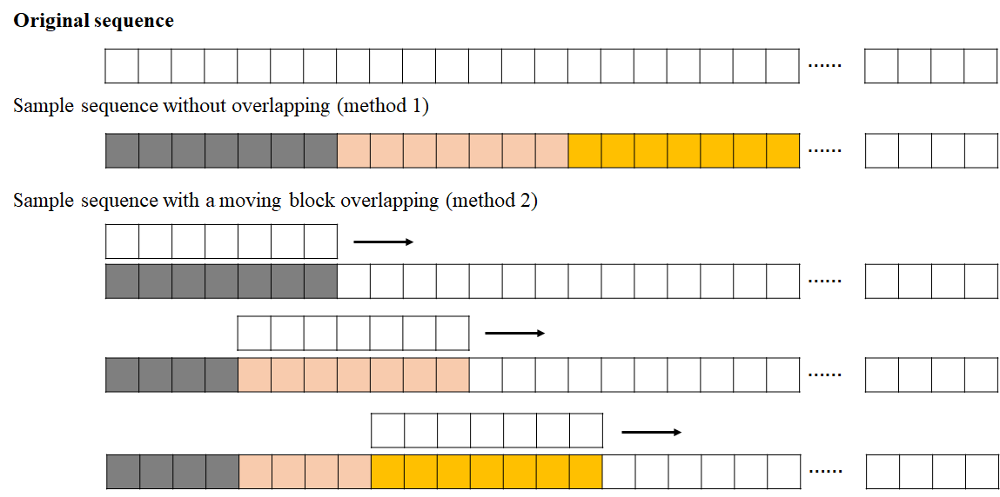

```{r setup, include=FALSE}
knitr::opts_chunk$set(echo = FALSE)
```

## 1. Ecological time-series (question)

Most phenomena in ecology are assessed with repeated measurements of environmental variables. The time-series analysis is to describe and quantify the dynamic behavior underlying these observations, to link different observations and give hints towards the origin of observed phenomena. Although the dynamics of the time series are investigated with a variety of statistical techniques and nonlinear methods, which allow the separation of short- and long-term components, the crucial question is how to find the optimal temporal resolution (Lange, H. ENCYCLOPEDIA OF LIFE SCIENCES, 2005). This is a big question of time-series analysis in ecology.

The optimal temporal resolution for observing an ecological phenomena is very important. An important aspect of a time series is whether the measurements are taken in an equidistant manner or not. In particular, a decision has to be made if unequal measure intervals are regarded as imprecise, or count as gap or missing values. In addition, there is no fully satisfying procedure to fill these gaps with artificial values, including interpolation. Also, the gaps is linked to the significance of (auto-)correlations for the series.

To solve optimal temporal resolution, there have two types of analysis methods:  methods for analysis of temporal structures and methods for modelling them. Analysis methods aim to fully understand the dynamics and points to plausible explanations. But models seek to reconstruct observed and predict future behavior, without understanding it. Here the approach worth mention is RNN, a flexible technique to detect and describe almost any structure in multivariate data sets. it is capable of providing empirical on-line n-step-ahead prediction by adjustment of weights of connections, and therefor can be used to detect optimal temporal resolution based on the model performance. We use different length of time series to predict a given day, and compare their model accuracy. The higher the model accuracy, the more likely the length approximates to the optimal temporal resolution.

## 2. Recurrent neural networks 

### 2.1 Forward NN and RNN

RNN works on the principle of saving the output of a hidden layer and feeding this back to the input for predicting its output. Below is how to convert a Feed-Forward Neural Network into a RNN. Compared with the feed-forward neural network, RNN has additional loop from a neuron to itself and information transformation from the first neuron to second, third, ..., in the hidden layer.

{width=80%}
RNN is designed to process sequences of data, and works well for jobs requiring sequences, such as time series data.

### 2.2 The feedback loop

RNN achieves a memory through a feedback loop in the cell. It is the main difference between a RNN and a traditional NN. The feedback loop allows information to be passed in a layer in contrast to feedforward NN in which information is only passed between layers.

RNNs must define what information is relevant enough to be kept in the memory. For this, different types of RNN evolved: 1) Traditional RNN, 2) Long-Short-term-Memory RNA (LSTM), and 3) Gated Recurrent Unit RNA.

#### 2.2.1 Recurrent neural network

For RNN, through the feedback loop the output of one RNN cell is used as an input by the same cell. Then each cell has two inputs: the past and the present. Using information of the past results in a short term memory. We unfold the feedback loop of an RNN cell (see the following figure). The length of the unfolded cell is equal to the number of the time steps of the input sequence.

{width=80%}
In each cell the input of the current time step x (present value), the hidden state h of the previous time step (past value) and a bias are combined and then limited by an activation function to determine the hidden state of the current time step. The weights W of the RNN are updated through a backpropagation in time (BPTT) algorithm.

#### 2.2.2 Long-Short-Term-Memory (LSTM)

LSTMs are a special type of RNNs which tackle the vanishing/exploding problems of a simple RNN. Saying, we have a sequence of 4 time points and using them to predict next time. The flow chart of a LSTM can be designed as follows.


The key to LSTMs is the cell state. The cell state has 3 gates, forget gate, input gate, and ouput gate. They filter and control the flow of information and determine which information is kept or disregarded (see the following figure).


#### 2.2.3 Gated Recurrent Unit (GRU)

Similar to LSTMs, GRU solves the vanishing gradient problem of simple RNNs. The difference to LSTMs is that GRUs use fewer gates, which do not have a separate internal memory, i.e., cell state, but relies on the hidden state as a memory, leading to a simpler architecture.

### 2.3 Setting R for RNN

First, we need to make sure that R environment is set up. We are going to load in a couple of utility packages.

```{r echo=TRUE}
# rm(list = ls())
# library(keras) # for deep learning
# library(tidyverse) # general utility functions
# library(caret) # machine learning utility functions
```

Next, we need to read data, and look at the first couple of rows of a dataframe to make sure the data looks reasonable.

```{r echo=TRUE}
# weather_data <- read_csv("seattleWeather_1948-2017.csv") # read in our data
# nrow(weather_data)
# head(weather_data) # check out the first few rows
```

## 3. Classification with RNN

### 3.1 Set model parameters

We have the dataset of seattle weather. It can be downloaded from [the website](https://github.com/russellromney/seattle-weather/blob/master/seattleWeather_1948-2017.csv). It contains information on the weather in Seattle for every single day between Jan 1, 1948 and Dec 12, 2017. We want to predict whether it is  rain or not of a given day based on the weather observation of the previous six day For more details, see [the website](https://www.kaggle.com/code/rtatman/beginner-s-intro-to-rnn-s-in-r).

We set 3 parameters for model: 1) The maximum length of the sequence that we're going to look at to try and predict the next item; 2) The batch size, which is the number of distinct sequences to look at at one time during training; 3) The total number of epochs to train for.

```{r echo=TRUE}
# max_len <- 6 # based on the six days for predicting next day
# batch_size <- 32 # number of sequences to look at at one time during training
# total_epochs <- 15 # how many times we'll look @ the whole dataset
# set.seed(123) # set a random seed for reproducability
```

### 3.2 Pre-processing data

#### 3.2.1 Generating samples

We need to do some pre-processing to get our data ready to feed into our model. First, we select the column we're interested in predicting and summarize it for checking whether the dataset is balanced and has missing values.

```{r echo=TRUE}
# rain <- weather_data$RAIN # select the colum with info on how often it rained
# nrow(weather_data)
# table(rain) # summery
```

Next task is to chop this timeseries into samples of our max_length + 1. We can start at the beginning of the vector, and chop it into the non-overlapping chunks of max_length + 1. It will only give us around 3600 (nrow(weather_data)/7) examples (it isn't enough to train a deep learning model). We can stretch out our data by using a moving-block sub-sampling to cut up our vector into overlapping chunks. That is, we move a block of max_length + 1 long and overlap 3 units for getting blocks like this.

<center>
{width=90%}
</center>
</br>

For cutting the text in overlapping sample sequences of max_len characters, we perform the following code.

```{r echo=TRUE}
# # get a list of start indexes for our (overlapping) chunks
# start_indexes <- seq(1, length(rain) - (max_len + 1), by = 3)
# # create an empty matrix to store our data in
# weather_matrix <- matrix(nrow = length(start_indexes), ncol = max_len + 1)
# # fill our matrix with the overlapping slices of our dataset
# for (i in 1:length(start_indexes)){
#   weather_matrix[i,] <- rain[start_indexes[i]:(start_indexes[i] + max_len)]
# }
```

#### 3.2.2 Correcting the data

Now that we have our sample data in a tidy matrix, we just need to do a couple of housekeeping things to make sure everything is good to go.

- Make sure your matrix is numeric. Since Keras expects a numeric matrix, we're going to convert our data from boolean to numeric by multiplying everything by one.

- Remove any NaN. If ending up with na in data, the model will compile and train just fine. But the model will prediction all be NaN. In this case we do need to do it, as is shown in the diagram above, our data slicing approach ended up adding na's to the dataset.

```{r echo=TRUE}
# # make sure it's numeric
# weather_matrix <- weather_matrix * 1
# # remove na's if you have them
# if(anyNA(weather_matrix)){
#     weather_matrix <- na.omit(weather_matrix)
# }
```

#### 3.2.3 Training and test sets

Now, we can get down to preparing it to be fed into our model. First, we need to split our dataset into the input (the 6 previous days) and the output (the single day we're interested in predicting). Following convention, we call our inputs X and output y.

```{r echo=TRUE}
# X <- weather_matrix[,-ncol(weather_matrix)]
# y <- weather_matrix[,ncol(weather_matrix)]
```

Now we need to split our data in to the test and training sets using the createDataPartition() function from the caret package. 

```{r echo=TRUE}
# training_index <- createDataPartition(y, p = .9, list = FALSE, times = 1)
# # training data
# X_train <- array(X[training_index,], dim = c(length(training_index), max_len, 1))
# y_train <- y[training_index]
# 
# # test data
# X_test <- array(X[-training_index,], dim = c(length(y) - length(training_index), max_len, 1))
# y_test <- y[-training_index]
```

### 3.3 Building and training RNN

#### 3.3.1 Specifying a RNN model

First, we tell Keras what type of model we want to build & initialize, Here we specify a sequential model (another option is to utilize the functional API). Let's stick with the sequential model with an input layer, a hidden layer and an output layer.

```{r echo=TRUE}
# model <- keras_model_sequential() # initialize our model
```

**Input layer**

Because model takes raw data as input, we specify what the dimensions of our data is. Let's look at the dimensions of the matrix that we'll be passing into our model to figure out what our input_shape should be.

```{r echo=TRUE}
# dim(X_train)
```

In this case, the 1st dimension is the number of our training samples, the 2nd is the length of input sequence (max_len), and the 3rd refers to the number of features (only one: whether it rained or not). We get the dimensions of the input array using the dim() function and pass those in as the input_shape.

The "units" argument tells us how many neurons in the input layer. For a sequence modelling, it makes sense to have the same number of units as the items in our input sequence, which we decided with the max_len parameter, so we are going to pass that to our model directly here.

```{r echo=TRUE}
# # our input layer
# model %>%
#     layer_dense(input_shape = dim(X_train)[2:3], units = max_len)
```

**Hidden layer**

Now let's tell Keras about our hidden layer. In this model, we use a single hidden layer. Inside it, each neuron is a model of our input sequence, where the 2nd item depends on the 1st item, the 3rd item on the 1st and 2nd items, the 4th item on the 1st, 2nd and 3th items, and so on. Since this is a recurrent network layer, there will be six different little models of our six-item input sequences. 

```{r echo=TRUE}
# model %>% 
#     layer_simple_rnn(units = 6)
```

**Output layer**

At this point, our model has 6 different outputs, one for each of the neurons in the hidden layer. But we want to predict only one output: whether it will rain the next day. So, we need to add an output layer that will take all information and squash it down to a single value. We specify this with the "units" argument. Here the units will be 1. 

We use a sigmoid activation function to take all inputs into a cell and transforms them into a number between zero and one, which is the probability that it will rain on the next day.

```{r echo=TRUE}
# model %>%
#     layer_dense(units = 1, activation = 'sigmoid') # output
```

Now let's take a look at our architecture. We can do this by using summary() to look at our model.

```{r echo=TRUE}
# # look at our model architecture
# summary(model)
```

#### 3.3.2 Compiling and training

We need to compile it and specify what the loss and optimizer, as well as what metric to track (if any).

```{r echo=TRUE}
# model %>% compile(loss = 'binary_crossentropy', 
#                   optimizer = 'RMSprop', 
#                   metrics = c('accuracy'))
```

We should have the validation split for evaluation, and need to pick our batch size and epochs for training.

 **Epochs and batch size**

The number of epochs is the number of times our model see our training dataset during training. Batch size denots how many samples that are fed into our model at a time. Our batch size is less than the total number of training samples, thus technically "mini batches".

**Validation split**

For validing our model we're setting a validation set to 0.1. This set is different from the test data at the beginning, which will be used to evaluate the final model once we're done training it.

**Training the model**

Now that we've got everything set up, it's time to train our model!

```{r echo=TRUE}
# trained_model <- model %>% fit(
#     x = X_train, # sequence we're using for prediction 
#     y = y_train, # sequence we're predicting
#     batch_size = batch_size, 
#     epochs = total_epochs, 
#     validation_split = 0.1) 
```

### 3.3.3 Evaluate RNN model

In this case, we wanted to predict whether it would rain tomorrow or not next day, so we're probably going to be interested in looking at how accurate our predictions are.

First, we can look at how well our model did on our validation data during training after training. This tells us the accuracy and loss on both our training data (first two rows) and validation data (second two rows) after the last epoch of training. We can see that, for our validation data, our model had 74% accuracy in predicting weather it would rain the next day or not based on the previous six days.

```{r echo=TRUE}
# trained_model
# plot(trained_model)
```

This looks pretty good! We can probably have stopped training a couple of epoch earlier, since both accuracy and loss flattened out around 5 epochs. 

Now's the time when we dig it back up and use the test data to check our how good our model is at predicting the weather. For a little more nuanced look into our model results, we're going to use a confusion matrix. 

```{r echo=TRUE}
# # Predict the classes for the test data
# classes <- model %>% predict(X_test, batch_size = batch_size) %>%
#   `>`(0.5) %>% k_cast("int32")
# 
# # Confusion matrix
# table(y_test, as.vector(classes))
```

We can also find out what our model's loss and accuracy on our training data.

```{r echo=TRUE}
# model %>% evaluate(X_test, y_test, batch_size = batch_size)
```

## 4. Regression with RNN

We use the U.S. long-term interest rates data to illustrate the regression with RNN. The data are available [here](https://data.oecd.org/interest/long-term-interest-rates.htm). This is a monthly data from Jan 2007 to March 2018. For the full code, see [the website](http://rwanjohi.rbind.io/2018/04/05/time-series-forecasting-using-lstm-in-r/)

### 4.1 Load the libraries & the dataset

```{r echo=TRUE}
# rm(list = ls())
# 
# # loading and checking data
# us_data <- read.csv("us_data.csv", stringsAsFactors = FALSE)
# class(us_data)
# str(us_data)
# head(us_data)
# 
# # converting TIME to date
# library("anytime") 
# us_data$Time <- anydate(us_data$TIME)
# class(us_data$Time) # view R class of data
# head(us_data$Time)
# us_data
# 
# # quickly ploting data
# ggplot(us_data, aes(x=Time, y=Value)) + 
#   geom_line(color = "blue") +
#   theme_classic() + 
#   ggtitle("U.S. long-term interest rates") + xlab("Time") + ylab("Value")
```

### 4.2 Data preparison

**stationary**

This is done by getting the difference between two consecutive values in the timeseries. This transformation, commonly known as differencing, removes components in the data that are time dependent. Furthermore, it is easier to model using the difference, rather than the raw values, and the resulting model has a higher predictive power.


```{r echo=TRUE}
# # transform data to stationarity
# diffed = diff(us_data$Value, differences = 1)
# head(diffed)
```

**Lagged dataset**

LSTM expects the data to be in a supervised learning mode. That is, having a target variable Y and predictor X. To achieve this, we transform the series by lagging the series and have the value at time (t−k) as the input and value at time t as the ouput, for a k-step lagged dataset.

```{r echo=TRUE}
# lag_transform <- function(x, k= 1){
#     
#       lagged =  c(rep(NA, k), x[1:(length(x)-k)])
#       DF = as.data.frame(cbind(lagged, x))
#       colnames(DF) <- c(paste0('x-', k), 'x')
#       DF[is.na(DF)] <- 0
#       return(DF)
# }
# supervised = lag_transform(diffed, 1)
# head(supervised)
```

**training and testing**

Unlike in analysis where training and test data sets are randomly sampled, with time series data the order of the observations does matter. The following code split the first 70% of the series as training set and the remaining 30% as test set.

```{r echo=TRUE}
# ## split into train and test sets
# N = nrow(supervised)
# n = round(N *0.7, digits = 0)
# train = supervised[1:n, ]
# test  = supervised[(n+1):N,  ]
```

**Normalize the data**

Just like in any other neural network model, we rescale the input data X to the range of the activation function. As shown earlier, the default activation function for LSTM is sigmoid function whose range is [-1, 1]. The code below will help in the transformation. Note that the min and max values of the training data set are the scaling coefficients used to scale both the training and test data sets as well as the predicted values. This ensures that the min and max values of the test data do not influence the model.

```{r echo=TRUE}
# scale_data = function(train, test, feature_range = c(0, 1)) {
#   x = train
#   fr_min = feature_range[1]
#   fr_max = feature_range[2]
#   std_train = ((x - min(x) ) / (max(x) - min(x)  ))
#   std_test  = ((test - min(x) ) / (max(x) - min(x)  ))
#   
#   scaled_train = std_train *(fr_max -fr_min) + fr_min
#   scaled_test = std_test *(fr_max -fr_min) + fr_min
#   
#   return( list(scaled_train = as.vector(scaled_train), scaled_test = as.vector(scaled_test) ,scaler= c(min =min(x), max = max(x))) )
#   
# }
# 
# 
# Scaled = scale_data(train, test, c(-1, 1))
# 
# y_train = Scaled$scaled_train$x
# x_train = Scaled$scaled_train$`x-1`
# 
# y_test = Scaled$scaled_test$x
# x_test = Scaled$scaled_test$`x-1`
# 
# ## inverse-transform
# invert_scaling = function(scaled, scaler, feature_range = c(0, 1)){
#   min = scaler[1]
#   max = scaler[2]
#   t = length(scaled)
#   mins = feature_range[1]
#   maxs = feature_range[2]
#   inverted_dfs = numeric(t)
#   
#   for( i in 1:t){
#     X = (scaled[i]- mins)/(maxs - mins)
#     rawValues = X *(max - min) + min
#     inverted_dfs[i] <- rawValues
#   }
#   return(inverted_dfs)
# }
```

## 4.3 Building lstm RNN

**Define the model**

We set the argument stateful= TRUE so that the internal states obtained after processing a batch of samples are reused as initial states for the samples of the next batch. Since the network is stateful, we provide the input batch in 3-d array [samples, timesteps, features] from the current [samples, features], where:

Samples: Number of observations in each batch, also known as the batch size.
Timesteps: Separate time steps for a given observations.  Here the timesteps = 1
Features: For a univariate case, the features = 1

The batch size must be a common factor of sizes of both the training and test samples. 1 is always a sure bet. A nice explanation of LSTM input can be found [here](https://machinelearningmastery.com/reshape-input-data-long-short-term-memory-networks-keras/).

```{r echo=TRUE}
# # Reshape the input to 3-dim
# dim(x_train) <- c(length(x_train), 1, 1)
# 
# # specify required arguments
# X_shape2 = dim(x_train)[2]
# X_shape3 = dim(x_train)[3]
# batch_size = 1 # must be a common factor of both the train and test samples
# units = 1 # can adjust this, in model tuninig phase
# 
# model <- keras_model_sequential() 
# model %>%
#   layer_lstm(units, batch_input_shape = c(batch_size, X_shape2, X_shape3), stateful= TRUE) %>%
#   layer_dense(units = 1)
```

**Compile the model**

Here I have specified the mean_squared_error as the loss function, Adaptive Monument Estimation (ADAM) as the optimization algorithm and learning rate and learning rate decay over each update. Finaly, I have used the accuracy as the metric to assess the model performance.

```{r echo=TRUE}
# model %>% compile(
#   loss = 'mean_squared_error',
#   optimizer = optimizer_adam(),
#   metrics = c('accuracy')
# )
#
# summary(model)
```
**Fit the model**

We set the argument shuffle = FALSE to avoid shuffling the training set and maintain the dependencies between xi and xi+t. LSTM also requires resetting of the network state after each epoch. To achieve this we run a loop over epochs where within each epoch we fit the model and reset the states via the argument reset_states().

```{r echo=TRUE}
# Epochs = 50   
# for(i in 1:Epochs ){
#   model %>% fit(x_train, y_train, epochs=1, batch_size=batch_size, verbose=1, shuffle=FALSE)
#   model %>% reset_states()
# }
```

**Model evaluation**

```{r echo=TRUE}
# L = length(x_test)
# scaler = Scaled$scaler
# predictions = numeric(L)
# 
# for(i in 1:L){
#      X = x_test[i]
#      dim(X) = c(1,1,1)
#      yhat = model %>% predict(X, batch_size=batch_size)
#      # invert scaling
#      yhat = invert_scaling(yhat, scaler,  c(-1, 1))
#      # invert differencing
#      yhat  = yhat + Series[(n+i)]
#      # store
#      predictions[i] <- yhat
# }
```

