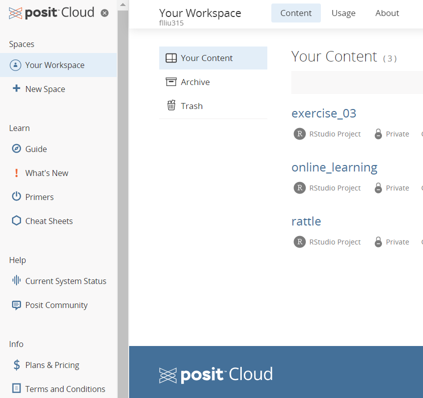

```{r setup, include=FALSE}
knitr::opts_chunk$set(echo = FALSE)
```

You need to install R and RStudion on your computers. We will go through the following steps to install two free programs. Also, you'll understand basic R commands, and the RStudio interface with R in order to start programming.

## 1. Using Rstudio to interact with R
### 1.1 Installing R and RStudio
<mark style="background-color: #F0F0F0">R and RStudio</mark> are two separate pieces of software: 

- **R** is a programming language that is especially powerful for data exploration, visualization, and statistical analysis
- **RStudio** is an integrated development environment (IDE) that makes using R easier

In this class we will use **RStudio** to interact with **R**. The following steps outline a simple and effective process for installing R and RStudio on your computers.

#### Windows

- Download R from [CRAN](https://cran.r-project.org/bin/windows/base/release.htm). Run the `.exe` file that was just downloaded.
- Next to [RStudio](https://www.rstudio.com/products/rstudio/download/#download) to download the RStudio Installer for Windows, and double click the file to install it.
- A good practice to install [RTools](https://cran.r-project.org/bin/windows/Rtools/), corresponding to R version, for building R and R packages from source on Windows.
- Once installed, open RStudio to make sure it works and you don't get any error messages.

#### MacOS

- Go to [CRAN](https://cran.r-project.org/bin/macosx/), and select the <mark style="background-color: #F0F0F0"`.pkg`</mark> file for the latest R version. Double click on the downloaded file to install R.
- A good idea to install [XQuartz](https://www.xquartz.org/) (needed by some packages).
- Go to [RStudio](https://www.rstudio.com/products/rstudio/download/#download) to download the RStudio Installer for MacOS. Double click the file to install RStudio.
- Once installed, open RStudio to make sure it works and you don't get any error messages.

#### Linux

- Follow the instructions from [CRAN](https://cloud.r-project.org/bin/linux), run
  <mark style="background-color: #F0F0F0">`sudo apt-get install r-base`</mark> for Debian/Ubuntu and <mark style="background-color: #F0F0F0">`sudo yum install R`</mark> for Fedora, but the installed versions of R are usually out of date.
- Go to [RStudio](https://www.rstudio.com/products/rstudio/download/#download), select the version that matches your distribution to run <mark style="background-color: #F0F0F0">`sudo dpkg -i rstudio-YYYY.MM.X-ZZZ-amd64.deb`</mark> for Debian/Ubuntu at the terminal.
- Once installed, open RStudio to make sure it works and you don't get any error messages.


If R and RStudio are installed, determine whether your R and RStudio versions are necessary to up to date.

### 1.2 Updating R and RStudio
#### Updating R 
- Opening RStudio, your R version will be printed in the console. Alternatively, you can type **sessionInfo()** into the console. If the R version is 4.0.0 or later, don't need to update R for this class. If the version of R is older than that, download and install the latest version of R.
- It is not necessary to remove old versions of R from your system, 
  but if you wish to do so you can check
  [How do I uninstall R?](https://cran.r-project.org/bin/windows/base/rw-FAQ.html#How-do-I-UNinstall-R_003f). 
- Normally, your old code should still work after updating your R version. But if breaking changes happen, it is useful to know that you have multiple versions of R installed in parallel and that you can switch between them in RStudio by going to <mark style="background-color: #F0F0F0">`Tools > Global Options > General > Basic`</mark>
- After installing a new version of R, you will have to reinstall all your packages with the new one. For Windows, there is a package called **`installr`** that can help you with upgrading your R version and migrate your package library.

#### Updating RStudio  
To update RStudio, open RStudio and click on 
<mark style="background-color: #F0F0F0">`Help > Check for Updates`</mark>. If a new version is available, RStudio will automatically notify you every once in a while.

### 1.3 Setting up RStudio Cloud
If it isn’t feasible to install R and RStudio Desktop on your computer, you can use RStudio Cloud and run R in an online browser window. For this purpose, you need to sign up and create a new account of RStudio Cloud.

<!-- <iframe width="560" height="400" src="https://www.youtube.com/embed/L2KT0ls_oIk?si=pjYyWEYlKBJ7h7ZC" title="YouTube video player" frameborder="0" allow="accelerometer; autoplay; clipboard-write; encrypted-media; gyroscope; picture-in-picture; web-share" allowfullscreen></iframe> -->

<!-- #### Setting up  -->
<!-- - Go to https://rstudio.cloud/. -->
<!-- - Sign up with an email and create a password of your choice. -->
<!-- - Sign In. -->

#### Navigating
Once log in, you should look for a few things. On the left hand side, you should see column that displays your “Spaces”, you can check for Learning, as well as some additional info on the system status and terms and conditions.



On the right hand side, you should see a small chart showing your Account Usage. This is what you want to keep track of. Depending on how much time you spend actually running code, your time will vary, but the standard free account provides 15 hours per month.

#### Getting Setup
- Click on New Project, and wait a second for things to initialize.
- Name your project.
- Copy and install the packages we’ll need.
- Check everything is installed…you should get TRUE’s if everything worked.


### 1.4 Installing R packages

Most of the work in R is done by basic functions, which are wrapped into packages. Except for basic functions, R packages have build-in sample data sets. 

By default, a set of R packages is installed during R installation. There also are many packages that are needed to install later from the central repositories like [CRAN](https://cran.r-project.org/) or [Bioconductor](https://www.bioconductor.org/), as well as developer repositories like R-Forge(https://r-forge.r-project.org/) or [GitHub](https://github.com/).

#### Installing R packages

To install R packages, open RStudio and copy and paste the following command into the console window, then execute the command.

- Installing from CRAN

```{r eval=FALSE, echo=TRUE}
install.packages("tidyverse")
install.packages("RSQLite")
# Alternatively
install.packages(c("tidyverse", "RSQLite"))
```

- Installing from GitHub

```{r eval=FALSE, echo=TRUE}
install.packages ("devtools")
devtools::install_github ("grssnbchr/hexbin")
```

- Installing from R-Forge

```{r echo=TRUE}
#install.packages("patchwork", repos="http://R-Forge.R-project.org")
```

Alternatively, you can install the packages using RStudio interface by going to <mark style="background-color: #F0F0F0">`Tools > Install Packages`</mark> and typing the names of the packages separated by a comma.

When the installation has finished, you can try to load the
packages by pasting the following code into the console:

```{r eval=FALSE, echo=TRUE}
library(tidyverse)
library(hexbin)
library(patchwork)
library(RSQLite)
```

#### Updating R packages

It is recommended to keep your R version and all packages up to date. To update the packages that you have installed, click **`Update`** in the **`Packages`** tab in the bottom right panel of RStudio, or go to <mark style="background-color: #F0F0F0">`Tools > Check for Package Updates...`</mark>. 


## 2. Creating a R project
### 2.1 Using a project to organize your work
When using R several years ago, it is ususally to first set a working directory using <mark style="background-color: #F0F0F0">setwd()</mark>, which takes an absolute file path as an input and sets it as the current working directory of the R process, and to then use <mark style="background-color: #F0F0F0">getwd()</mark> for finding out whether the current working directory is correctly set. The problem with this approach is that since <mark style="background-color: #F0F0F0">setwd()</mark> relies on an absolute file path. This makes the links break very easily, and very difficult to share your analysis with others.

An RStudio project solves the problem of ‘fragile’ file paths by making file paths relative. An RStudio projects is the file that sits in the root directory, with the extension .Rproj. When your RStudio session is running through .Rproj, the current working directory points to the root folder where that .Rproj file is saved.

This .Rproj file can be created by going to <mark style="background-color: #F0F0F0">File > New Project…</mark> in RStudio, which is then link a specified folder or directory that is stand-alone and portable. You can reading data from or writing data to files within this directory, except for cases where your analysis requires interacting with an Internet data source, such as web-scraping. When opening an existing project, you will open the .Rproj file and subsequently open R scripts (extensions with .R) from the RStudio session, rather than going to the R scripts to open them. There are lots of documents on RStudio projects, which have detail information on .RData and .Rhistory files.

### 2.2 Working directory structure
This directory structure ‘template’ can provide a good starting point for organizing projects if workflow is new to you. However, different projects will have different needs, and thus one should think about what is needed and what will happen while setting up the working directory structure. A template of an R project like [this](https://www.r-bloggers.com/2018/08/structuring-r-projects/):

#### The data folder

The <mark style="background-color: #F0F0F0">data</mark> folder is is the subfolder where data are stored. They include any source files, such as SPSS, Excel/CSV or .RDS., and some generated ones. Someone would like to split the subfolder into three parts:

- a <mark style="background-color: #F0F0F0">data/raw/</mark> folder, which is usually is symlinked to a folder that is read-only to the R user
- a <mark style="background-color: #F0F0F0">data/temp/</mark> folder, which contains temp data
- a <mark style="background-color: #F0F0F0">data/output/</mark> folder, if warranted

#### The src folder

This folder stores R script files (with the extension .R) and Rmarkdown ones (with the extension .Rmd) for data analysis and visualization. There are three types of R scripts:

- Scripts: It is helpful to separate multiple scripts for different tasks on a single data set. Most analysis R scripts are saved here. But the key analysis script is better to be stored lonely. 
- Functions: It is optional whether you have your custom functions saved in a separate sub-folder. If you want to re-use a function that you remember you’ve written in a particular project, I can at a quick glance browse all the functions you’ve written for that project. Saving functions separately accompanies a workflow where you use source() to read functions into the ‘main analysis script’, rather than having it together with main analysis.
- RMarkdown: RMarkdown files are a special case, as they work slightly differently to .R files in terms of file paths, i.e. they behave like mini projects of their own, where the default working directory is where the Rmd file is saved. To save RMarkdown files in this set up, it’s recommended that you use the {here} package and its workflow. Alternatively, you can run knitr::opts_knit$set(root.dir = "../") in your setup chunk so that the working directory is set in the root directory rather than another sub-folder where the RMarkdown file is saved (less ideal than using <mark style="background-color: #F0F0F0">here</mark> package and its workflow). You briefly discussed a directory structure for combining multiple RMarkdown files into a single long [RMarkdown document](https://martinctc.github.io/blog/first-world-problems-very-long-rmarkdown-documents/).

#### The output folder

In Output folder, save all your outputs here, including plots, HTML, and data exports.

  - Having this Output folder helps others identify what files are outputs of the code, as opposed to source files that were used to produce the analysis.
  - What you have set up as the sub-folders don’t matter too much, as long as they’re sensible. Normally, the output folders structure as <mark style="background-color: #F0F0F0">output/ figs/</mark> or <mark style="background-color: #F0F0F0">output/ plots/</mark>, rather than top-tier folders. They also include word or PDF report results. You may decide to set up the sub-folders so that they align with the analysis rather than type of file export.
  - The <mark style="background-color: #F0F0F0">timed_fn()</mark> function from my package <mark style="background-color: #F0F0F0">surveytoolbox</mark> (available on <mark style="background-color: #F0F0F0">GitHub</mark>) helps create timestamps for file names, which you use often to ensure that you don’t lose work when you am iterating analysis.
  
### 2.3 General settings

- The requirement.R file: In this case, you should have a requirements.R file. Running it for fundamental settings you like to rely on, such as setting the locale appropriately. It also includes a CRAN install check script, although the <mark style="background-color: #F0F0F0">Packrat</mark> package is advised to use.
- Using <mark style="background-color: #F0F0F0">keyring</mark> package: The <mark style="background-color: #F0F0F0">keyring</mark> package, which interacts with OS X’s keychain, Windows’s Credential Store and the Secret Service API on Linux (where supported)
- Using environment variables: Using environment variables to hold certain secrets has become extremely popular especially for Dockerised implementations of R code, as envvars can be very easily set using Docker. If you create an envfile called .Renviron in the working directory, it will store values in the environment.
- Using a .gitignored secret file: <mark style="background-color: #F0F0F0">config</mark> is a package that allows you to keep a range of configuration settings outside your code, in a YAML file, then retrieve them. You can create a default configuration for an API. A dedicated secrets file is a better place for credentials than a <mark style="background-color: #F0F0F0">config</mark> file, as this file can then be wholesale .gitignore.

### 2.4 Automatically running

There is a main runner script or potentially a small number. These go through scripts in a sequence. It is a sensible idea in such a case to establish sequential subfolders or sequentially numbered scripts that are executed in sequence. Typically, this model performs better if there are at most a handful distinct pipelines.

## 3. Connecting a R project to Github
### 3.1 Checkinf that RStudio can find Git
The first task is to ensure that Git can be located by RStudio on your machine. To do this, open <mark style="background-color: #F0F0F0">RStudio</mark> and go to <mark style="background-color: #F0F0F0">Tools > Global Options > Git/SVN</mark>.

Under <mark style="background-color: #F0F0F0">"Git executable"</mark>, you should be able to see a path to Git. Take ubuntu as example, it will be in <mark style="background-color: #F0F0F0">/usr/bin/git</mark>.

If Git is not in this location or you want to check where the Git executable path is, open the Command Prompt in <mark style="background-color: #F0F0F0">ubuntu or Windows</mark> terminal. Type <mark style="background-color: #F0F0F0">where git</mark> to reveal the Git executable file path.

If it doesn’t match the dialogue box in RStudio, click on <mark style="background-color: #F0F0F0">"Browse…"</mark> and navigate to your Git executable file. Once complete, press "OK".

### 3.2 Adding a new R project to GitHub
If you want to start a new RStudio project and have it backed-up on GitHub, follow the following steps:

- Firstly, create an acount of <mark style="background-color: #F0F0F0">Github</mark>, and a new repository on the GitHub website. You can choose public or private for your visibility setting
- Next, open up RStudio and go to <mark style="background-color: #F0F0F0">File > New Project… > Version Control</mark>, and click on the <mark style="background-color: #F0F0F0">"Git"</mark> option
- Fill in the URL of the new GitHub repository that you just created in the <mark style="background-color: #F0F0F0">"Repository URL"</mark box. The <mark style="background-color: #F0F0F0">"Project Directory Name"</mark> will auto-fill. Click on <mark style="background-color: #F0F0F0">"Open in New Session"</mark> and then click on <mark style="background-color: #F0F0F0">"Create Project"</mark>. A new project window will open up in <mark style="background-color: #F0F0F0">RStudio</mark> containing your new project. You will notice that it will contain some files under the "Files" window including <mark style="background-color: #F0F0F0">.gitignore, .Rproj and README.md</mark>. The last file was pulled-down from your <mark style="background-color: #F0F0F0">GitHub</mark> repository
- Next, to demonstrate how changes can be saved, you will create a new script file and add some code. This will then be saved locally. Following that, you will <mark style="background-color: #F0F0F0">"push"</mark> my changes to <mark style="background-color: #F0F0F0">GitHub</mark> so that my changes are also saved remotely. To do this, go to <mark style="background-color: #F0F0F0">File > New File > R Script in RStudio</mark>. Write an R script and save it

- This has saved your work to your computer, but not to GitHub. For saving to GitHub, go to the <mark style="background-color: #F0F0F0">"Git"</mark> tab in the upper right pane. Check the <mark style="background-color: #F0F0F0">"Staged"</mark> box for any files whose existence or modifications you want to commit

- Click on <mark style="background-color: #F0F0F0">"Commit"</mark> and a new dialogue box will open. Under <mark style="background-color: #F0F0F0">"Commit Message"</mark>, add a brief description of the changes that you have made

- Click on <mark style="background-color: #F0F0F0">"Commit"</mark>. A Git Commit dialogue box will be displayed showing that the files are committed to GitHub. You may close this second window by clicking <mark style="background-color: #F0F0F0">"Close"</mark>

- Complete the final step by pressing <mark style="background-color: #F0F0F0">Push</mark>. This will upload the R files to GitHub. You will see a dialogue box come up confirming this in the form of a string followed by <mark style="background-color: #F0F0F0">HEAD -> main</mark>

### 3.3 Adding an existing R project to GitHub
If you have an existing project in RStudio and decide later that maintaining version control in GitHub would be a good idea, follow the steps:

- Firstly, create a new repository on GitHub via the website, and choose a repository name like above
- Next, open the Command Prompt (or ubuntu terminal) and go to the folder that contains your existing R project, then substitute the URL for your GitHub repository address for remote add origin and push by performing the following codes

```{r echo=TRUE}
# git remote add origin https://github.com/yourusername/yourrepo
# git pull origin main
# git push -u origin main
```


## 4. Writing R code
### 4.1 Using script
Using R understand language to tell R what and how do the thing that you want. We refer this discription to "script". 

#### Creating R script
A script is simply a text file that contains a set of commands and comments. It can be saved and reused later. It can also be edited so you can execute a modified version of the commands.

To create a new script in RStudio, you can open a new empty script by clicking the <mark style="background-color: #F0F0F0">New File-->New File Menu-->R Script</mark>. The script editor opens with an empty script, which is ready for text entry. Here is an example to familiarize you with the Script Editor interface.


#### Saving R script 

You can save your script by clicking on the **Save** icon at the top of the Script Editor panel. When you do that, a Save File dialog will open. 

The default script name is **Untitled.R**. The Untitled part is highlighted. You will save this script as **First script.R**. Start typing **First script**. RStudio overwrites the highlighted default name with your new name, leaving the .R file extension.

Notice that RStudio will save your script to your current working folder. Press the **Save** button and your script is saved to your working folder. Notice that the name in the file at the top of the Script Editor panel now shows your saved script file name. 

While it is not necessary to use an **.R** file extension for your R scripts, it does make it easier for RStudio to work with them if your use this file extension. 

#### Opening R script

Click on the **Open an existing file** icon in the RStudio toolbar. A choose file dialog will open. Select the R script you want to open and click the **Open** button. Your script will open in the Script Editor panel with the script name in an editor tab. 


#### Commenting R script

In scripts, it can be very useful to save a bit of text which is not to be evaluated by R. You can leave a note to yourself about what the next line is supposed to do, what its strengths and limitations are, or anything else you want to remember later. To leave a note, we use “comments”, which are a line of text that starts with the hash symbol #. Anything on a line after a # will be ignored by R.

```{r echo=TRUE}
# This is a comment. Running this in R will have no effect.
```

#### Executing R script

The **Run** button in the Script Editor panel toolbar will run either the current line of code or any block of selected code. You can use your **First script.R** code to gain familiarity with this functionality.

Place the cursor anywhere in line 3 of your script [x = 34]. Now press the **Run** button in the Script Editor panel toolbar. Three things happen: 1) the code is transferred to the command console, 2) the code is executed, and 3) the cursor moves to the next line in your script. Press the **Run** button three more times. RStudio executes lines 4, 5, and 6 of your script. 

### 4.2 Using rmarkdown
Learn how to construct an RMarkdown file, please visit [the site](https://ourcodingclub.github.io/tutorials/rmarkdown/).

### 4.3 Objects and operators
#### R objects
In RStudio, if you want to create a object called x and give it a value of 4 using the symbol "<-", we would write:

```{r echo=TRUE}
x <- 4
x
```

The middle "<-" tells R to assign the value on the right to the object on the left. After running the command above, when running x in a command, it would be replaced by its value 4. If adding 3 to x, the expect would get 7.

```{r echo=TRUE}
x + 3
```

Object in R can store more than just simple numbers. It can store lists of numbers, functions, graphics, etc., depending on what values get assigned to the object.

You can always reassign a new value to a object. If telling R that x is equal to 32:

```{r echo=TRUE}
x <- 32
```

then x takes its new value:

```{r echo=TRUE}
x
```

Naming objects and functions in R is pretty flexible. A name has to start with a letter, but that can be followed by letters or numbers. Names in R are case-sensitive, which means that Weights and weights are completely different things to R. <mark style="background-color: #F0F0F0">A good idea is to give object names be as descriptive as possible</mark>, so that you will know what you meant later on when looking at it. Sometimes clear naming means that it is best to have multiple words in the name, but you can’t have spaces. A common approach is to <mark style="background-color: #F0F0F0">chain the words with underscores</mark>, as in weights_before_hospital. 

#### R operators

An operator is a symbol that tells the compiler to perform specific mathematical or logical manipulations. R language is rich in built-in operators and provides following types of operators.

- Arithmetic Operators: +, -, *, /
- Relational Operators: >, <, =, !=, etc
- Logical Operators: TRUE, FALSE
- Assignment Operators: <-  
- Miscellaneous Operators: %in%, :, %*%
